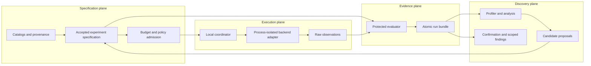

# Lean Model Lab architecture

Status: **architecture foundation accepted; research runtime not implemented**. Owner: Lucas Santana. Foundation date: 2026-09-07. Acceptance evidence: [STATUS.md](STATUS.md).

## Product contract

Lean Model Lab is a rigorous optimization laboratory for language-model training and inference. It should answer a bounded question: for an exact model, data/tokenizer contract, workload, runtime and hardware envelope, which candidate configurations improve a declared combination of quality, wall time, latency, throughput, memory, energy and cost, and where do those gains stop transferring?

The long-range ambition is a portable research programme that can progress from one laptop to heterogeneous devices and remote workers, compare training and serving ideas under shared evidence rules, and accumulate useful negative results. The first system remains a local command-line lab with filesystem artifacts. Scale follows measured need; it is not an initial infrastructure requirement.

Protected invariants:

- quality and workload semantics are fixed before optimization;
- training compute, processed tokens, elapsed time and time-to-quality remain different quantities;
- inference prefill, decode, queueing and end-to-end service behavior remain visible;
- simulated, modeled, estimated and measured values never share an unlabeled result class;
- every claim resolves to an accepted specification, exact inputs, runtime/hardware identity, raw observations and evaluator version;
- failed, invalid, cancelled, out-of-memory and inconclusive attempts remain part of campaign accounting;
- a candidate cannot modify its evaluator, confirmation set, resource ledger or accepted comparison contract;
- missing telemetry is reported as unavailable, never reconstructed from a nameplate power rating.

## Architecture layers



The coordinator moves work and accounts for resources; it does not decide scientific truth. An adapter translates a versioned contract into one backend process; it does not define metrics. The evaluator owns validity and quality decisions. Search may read development evidence, but confirmation evidence is released only through a separately authorized evaluation path.

## Domain model and contracts

All persisted contracts carry a schema version and reject unknown execution fields. Human-readable IDs aid navigation; intrinsic digests identify model weights, tokenizer assets, datasets and result artifacts where byte identity matters.

| Contract | Required identity and behavior |
| --- | --- |
| `ModelRecord` | Architecture/config, parameter count definition, weight artifact and format, source revision, license/use terms, precision, safe-loading policy and compatibility limits. A model name is insufficient identity. |
| `DataRecord` | Source snapshot, license and redistribution terms, original partitions, transformations and code revisions, deduplication/leakage checks, record counts and retained lineage. Synthetic data records generator source, version and seed. |
| `TokenizerRecord` | Vocabulary and merges/model files, normalization and pre-tokenization rules, special tokens, chat/prompt template, truncation/padding behavior and exact asset identity. Baseline and candidate use one accepted tokenizer unless tokenizer change is the declared research variable. |
| `WorkloadSpec` | Request or sequence population, prompt/input and output-length distributions, arrival process, concurrency, batching freedom, stop rules, seeds, request deadlines, quality set and invalid/missing-response rules. A stored trace and a generated distribution are distinct modes. |
| `HardwareRecord` | Device class and stable device identity where available, CPU/GPU/accelerator, memory capacity, topology/interconnect, relevant clocks/power mode, driver/firmware, thermal/power telemetry capabilities and instrumentation scope. |
| `RuntimeRecord` | OS, architecture, compiler, language/runtime, backend and library versions, build flags, environment variables that affect execution, numerical modes, thread/affinity settings, container or process boundary and source revision. Secrets are excluded. |
| `EvaluationPlan` | Primary and guardrail metrics, quality target, equivalence rules, development/confirmation partition, evaluation schedule and maximum accesses, sequential/multiple-testing rule when applicable, invalidity rules, repetitions, uncertainty method, resource ceiling and stopping decision. Accepted versions are append-only. |
| `CandidateSpec` | One declared change from its baseline, hypothesis, allowed files/configuration, expected effect, resource reservation and evaluator reference. It contains no evaluator code or development/confirmation answers. |
| `RunAttempt` | Logical run and attempt IDs, accepted inputs, worker/device lease, lifecycle events, timings, resource deltas, diagnostics, output references and terminal state. Retries append attempts and never overwrite a prior attempt. |
| `Finding` | Claim text, exact applicability envelope, baseline/candidate attempts, supporting and contradicting evidence, effect and uncertainty, quality decision, confirmation status, limitations and reviewer disposition. |

Provenance is a graph rather than a single “environment” string: a result links exact model, tokenizer, data, workload, evaluator, candidate, runtime, hardware and source identities. Derived artifacts link their parent artifacts and transformation. A portability claim requires separate findings per backend/device before any cross-device synthesis.

## Metric semantics

### Training

Training reports at least four separate axes:

1. **Work:** raw examples, source tokens, non-padding tokens presented, tokens contributing to loss, optimizer steps, global batch/accumulation and repeat exposure. Packing may reduce padding without being mislabeled as fewer semantic tokens.
2. **Compute:** model-useful FLOP estimates, recomputation/communication overhead when observable and device activity/profiler counters where supported. A FLOP model is labeled modeled compute; it is not elapsed time or hardware utilization.
3. **Time and capacity:** campaign setup, compile, initialization, data preparation, training, evaluation/checkpoint and recovery time; peak resident host memory and accelerator allocation/reservation where the backend exposes them.
4. **Quality:** predeclared held-out metric, time and work to first confirmed target, final quality at budget, stability/failure rate and seed distribution.

Training fixes the development-evaluation schedule in steps or non-padding tokens before a run. Development evaluation may guide training. Confirmation does not. The ordinary rule freezes the checkpoint-selection procedure, selects one checkpoint without confirmation feedback and evaluates that checkpoint once on untouched confirmation data. If a study needs protected sequential checkpoint evaluation, it must predeclare the checkpoint order, maximum accesses and a statistically justified sequential or multiple-testing decision rule; all checkpoints are frozen first and no intermediate confirmation outcome returns to training or search. “Time to confirmed quality” is claimed only within that procedure. Fixed-token, fixed-compute and fixed-wall-time studies are separate experiment families. Compute-optimal scaling results from published model families are hypotheses to test within their conditions, not universal ratios to copy into this lab.

### Inference

Every request retains arrival, admission, backend start, first-token, subsequent-token and completion timestamps when the adapter can observe them. Report:

- queue delay and admission/rejection outcome;
- prefill input tokens and prefill/first-token boundary;
- time to first token (TTFT), with the clock boundary stated as client-observed or backend-observed;
- inter-token latency (ITL) as the distribution of consecutive output-token gaps, plus time per output token (TPOT) when the study defines its aggregation;
- end-to-end latency, generated length and finish reason;
- request throughput, output-token throughput and total-token throughput as separate rates;
- goodput only against named request-level TTFT/TPOT/end-to-end/quality SLOs;
- p50/p95/p99 request tails, success, timeout, cancellation, rejection and drop counts;
- peak host/accelerator memory and KV-cache capacity/occupancy where observable;
- task-specific quality or distributional delta, never output length as a quality proxy.

Do not pool unlike prompt/output-length classes into one unexplained percentile. Under concurrency, preserve the arrival process, offered load, achieved load and per-request results; throughput from an always-full offline batch does not predict online latency.

### Full-wall cost and energy

A result declares one or more clock envelopes: cold end to end (environment readiness through evaluated artifacts), warm service (ready endpoint through completed requests), and kernel/operator scope. Report them side by side. Compilation, model/tokenizer load, cache preparation, evaluation, failed attempts and orchestration overhead cannot disappear from campaign cost merely because a backend benchmark omits them.

Energy records the sensor/API, device scope, sampling interval, start/end counter semantics and missing intervals. Direct counter energy, sampled-power integration and analytical energy estimates are different methods. Host-only or accelerator-only energy must say so. If an API returns unsupported, permissions fail or the counter scope cannot be established, measured energy is `UNAVAILABLE`; TDP multiplied by time is not a measurement.

## Measurement protocol

An accepted measurement plan declares the conditions that can materially move the result:

- cold/warm cache state; model and filesystem cache policy; compilation and warmup schedule;
- explicit synchronization at asynchronous CPU/accelerator boundaries before timestamps are compared;
- thermal state before and during runs, power/clock policy when observable, power source and cooling condition;
- CPU load, affinity/thread counts, accelerator sharing, background processes and memory pressure;
- request trace, concurrency, run order, seeds and baseline/candidate pairing;
- timer source/resolution, instrumentation overhead and clock boundary;
- minimum/maximum repetitions, outlier policy fixed before results, uncertainty method and practical-effect threshold.

Warmup samples are retained but excluded only according to the accepted plan. Baseline/candidate order is randomized or counterbalanced after any required cold-start controls. A run with unexpected throttling or contamination is marked with a reason; it is not silently deleted. If the gain is below noise or the practical threshold, the result is `INCONCLUSIVE` or “no demonstrated improvement.”

## Backend and platform boundary

`BackendAdapter` is a process protocol with four conceptual calls: `probe`, `prepare`, `run`, and `collect`. `probe` returns versioned capabilities rather than a broad “supported” boolean. `prepare` resolves only approved local artifacts. `run` accepts a canonical spec and bounded directories. `collect` returns raw events and declared telemetry support; metric scoring remains outside the adapter.

Initial seams are deliberately conditional:

- **CPU:** portable control path and first no-compute contract harness; vector ISA, BLAS and affinity are recorded only when used.
- **Apple Metal:** eligible only after a local capability and correctness probe. PyTorch MPS and llama.cpp Metal are separate adapters with different semantics, build/runtime identities and measurement support.
- **NVIDIA CUDA:** eligible only on an explicitly available device with compatible driver/toolkit/backend. CUDA event timing and NVML telemetry are optional capabilities, not assumptions.
- **Other serving/training engines:** added behind the same protocol only when a real experiment needs them and exact version/license/security/runtime review passes.

“Supported by upstream” means candidate capability, not that Lean Model Lab has implemented, tested or performance-qualified it. Cross-backend comparisons require equivalent model/tokenizer/workload semantics and backend-specific correctness checks.

## Profiling, search and confirmation

Optimization follows three isolated stages:

1. **Profile and diagnose:** collect bounded traces on development cases; name a bottleneck, uncertainty and falsifiable mechanism.
2. **Search and ablate:** compare single changes first, then declared combinations. Grid, random, Bayesian or agent proposals share one experiment/cost budget and evaluator. Every attempted point, including invalid and worse points, remains in the campaign ledger.
3. **Confirm:** lock the selected candidate and execute untouched cases with a separately reserved confirmation allocation and fresh attempt/evaluator release. Search plus confirmation remain in total campaign cost. Confirmation failure demotes the candidate; it does not reopen protected evidence for tuning.

The evaluator returns a metric vector and constraint decisions, not one magic score. Pareto dominance is computed only among valid candidates in the same comparison family. Quality, correctness and safety constraints are hard gates; preferences among latency, throughput, memory, energy and monetary cost are declared before selection. Reports show dominated, negative and inconclusive outcomes when they teach where a method fails.

## Durable execution, cancellation and recovery

Lifecycle: `PROPOSED -> ACCEPTED -> RESERVED -> QUEUED -> RUNNING -> EVALUATING -> TERMINAL`. Terminal states are `SUCCEEDED`, `QUALITY_REJECTED`, `INCONCLUSIVE`, `INVALID`, `FAILED`, `OOM`, `CANCELLED` and `BUDGET_EXHAUSTED`.

The local coordinator owns an append-only event journal and a monotonic budget ledger. It reserves wall-time, attempts, artifact bytes and any approved cost before a worker starts, reconciles actual usage after each attempt and does not erase charges for failures. Cancellation is durable intent: stop admission, signal the process group, escalate after a grace period, collect diagnostics, reconcile usage and atomically write the terminal record. A restart replays events, identifies abandoned workers, reconciles temp directories and either resumes from an explicitly compatible checkpoint or closes the attempt. “Resume” never means rerunning invisibly under the same attempt ID.

Multi-device work is deferred until local replay, cancellation, idempotent submission and artifact validation pass. A future remote worker receives an expiring experiment lease, approved inputs and bounded scratch/output locations; it cannot access protected evaluator data, credentials or arbitrary host paths. Capability matching selects eligible devices, while results stay device-specific. Loss of connection cannot extend a lease or budget. Remote outputs enter quarantine and pass schema, provenance and evaluator checks before becoming evidence.

Process separation alone is not a security boundary. The first prototype may run only reviewed built-in coordinator/evaluator code and inert development fixtures. Before executing any untrusted candidate, contributed adapter or proposing agent—or running protected confirmation—the system must enforce isolation outside that code with an OS sandbox, container or VM appropriate to the host. The enforcement profile denies network by default, injects no personal/provider/release credentials, mounts only approved inputs read-only, exposes only bounded scratch/output as writable, hides evaluator logic and protected data from candidate contexts, and applies CPU, accelerator, memory, process, wall-time and storage limits that the candidate cannot raise. Protected confirmation executes in a separate evaluator-controlled context. If the host cannot prove the required controls are active, the run is rejected rather than downgraded to best-effort isolation.

## Local-first module map and scale triggers

```text
src/contracts/       versioned records and validation
src/coordinator/     lifecycle, journal, budgets, cancellation and recovery
src/evaluation/      protected metrics, validity and confirmation boundary
src/artifacts/       atomic bundles, lineage and retention
src/analysis/        statistics, Pareto sets and reports
adapters/            process-isolated CPU/Metal/CUDA/backend implementations
workloads/           synthetic fixtures and accepted workload manifests
benchmarks/          controls, development cases and protected confirmation cases
experiments/         immutable accepted specs and candidate declarations
tools/               repository-plan and later artifact validators
tests/               contract, failure, recovery and representative integration checks
apps/workbench/      later read-oriented local comparison interface
```

Use the Python standard library for the first contract and plan harness. Adopt numerical or backend dependencies only through the Wave 1 decision. Add SQLite after concurrent or crash-recovery tests show filesystem locking/journal lookup is inadequate. Add multiple local workers after single-worker cancellation and duplicate prevention pass. Add remote execution after device need and elapsed-time benefit outweigh the security and operations cost. Add a service/database only after measured collaboration or query needs exceed local bundles. Extract a shared cross-project library only after two working consumers reveal a stable contract.

## Security and nonclaims

Inputs, model cards and generated text are untrusted data. Untrusted code never runs with personal credentials, default network access, arbitrary remote-code trust, shell interpolation or unrestricted filesystem access. Serialized model formats require a safe-loading decision. OS/container/VM policy—not application intent—enforces candidate read/write, credential, network and resource boundaries and protects evaluator logic and confirmation data. Publishing a finding, spending money, downloading gated weights, adding a production dependency or running remote/cloud compute requires separate authority.

This architecture does not claim an implemented simulator, benchmark runner, backend, energy meter, distributed system, autonomous researcher or research result. It defines the contracts against which those later systems can be built and falsified.
