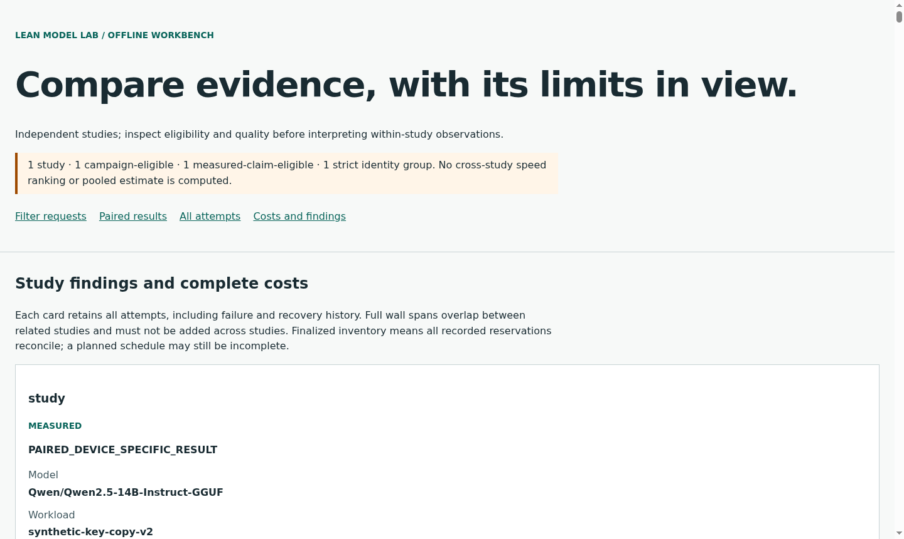
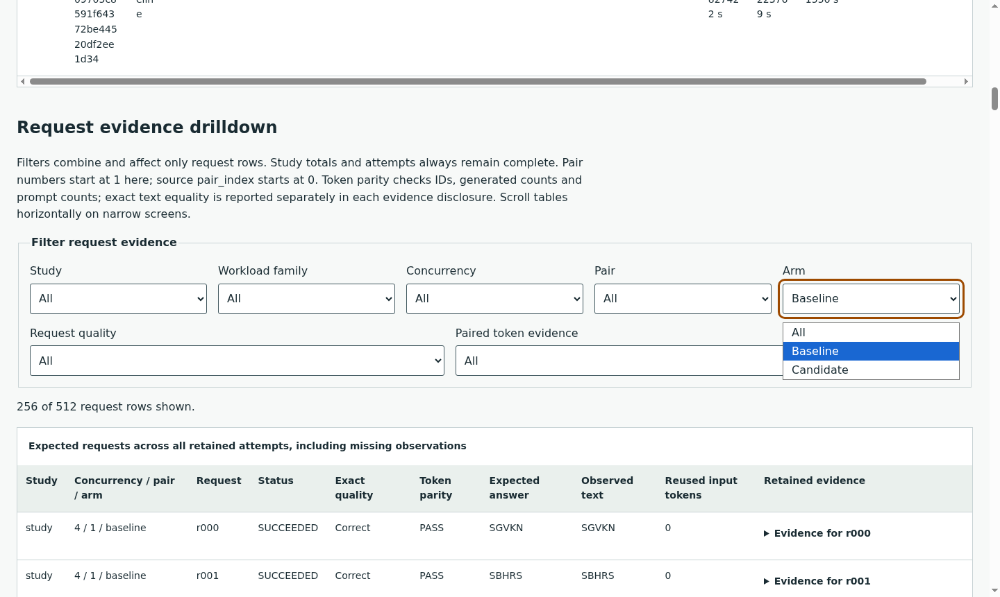
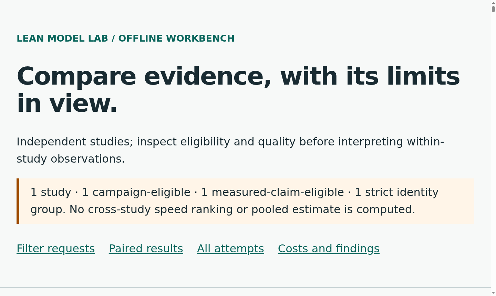
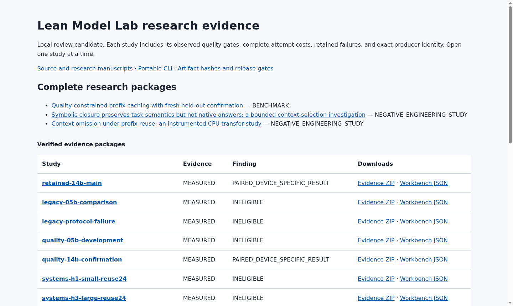
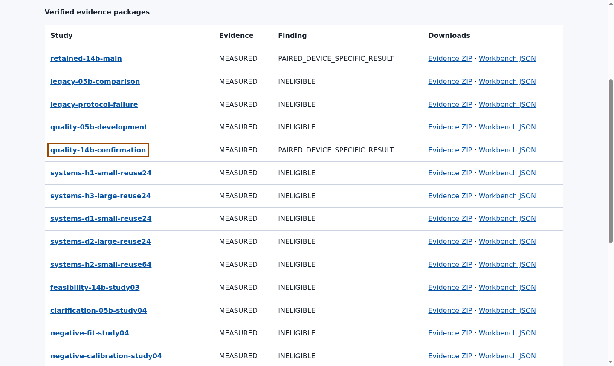

# Actual v1 workbench screenshots

These are unedited captures from the `1.0.0` archive06 renderer, using retained native research evidence in Chromium 140. The [browser receipt](../../evidence/v1-final-workbench-browser.json) binds the source HTML, browser, interaction harness and image bytes. They show local evidence inspection; they are not a public release or an external participant session.

The quality workbench contains 512 observations. Its eligible batch-efficiency result is separate from the frozen latency SLO, which no request met. Scroll to the study and attempt metrics to inspect both.

Keyboard selection shows 256 baseline observations. The test then reaches Reset filters, restores all 512 rows, and opens and closes a request's evidence using Enter. All seven selectors remain labelled; the count is a polite live status. These are observed task segments, not a human accessibility certification.

The zoom measurement is native browser zoom 2 with device pixel ratio 2 and unchanged CSS zoom. The narrow captures use a 390px emulated desktop viewport, with 375px content width after the scrollbar; they do not represent a physical mobile device. [Narrow layout](v1-workbench-quality-narrow.png) and [narrow keyboard focus](v1-workbench-quality-narrow-keyboard.png) are retained.

The [largest retained study](v1-workbench-largest-100.png) has 2,048 observation rows. It completed loading in 496 ms in one observation; the smaller 512-row page loaded in 117–125 ms across the three observed configurations. Those measurements are descriptive local observations, not percentiles, a scalability guarantee or a device comparison. The distribution presents separate study workbenches to avoid loading every campaign into one page.

The two `preliminary-workbench-*` images preserve the earlier workflow and producer boundary. They are historical captures, not substitutes for the final runtime checks.

## Final distribution index

These six unedited captures show the actual 23-study candidate04 index. The [index browser receipt](../../evidence/v1-final-distribution-index-browser.json) binds the document, all download hashes, native zoom, visible keyboard focus and navigation into the complete 512-observation quality workbench. Final delivery continuity verifies byte-identical index and study pages.

[Native200% view](v1-distribution-index-200.png), [200% keyboard focus](v1-distribution-index-200-keyboard.png), [390px narrow view](v1-distribution-index-narrow.png) and [narrow keyboard focus](v1-distribution-index-narrow-keyboard.png) retain the other observations. Wide tables scroll inside their labelled focusable region; offscreen columns require horizontal table navigation. This is a desktop viewport emulation, not a physical mobile device.

Observed index load times were 100: 6.2 ms, 200: 6 ms, narrow: 6.7 ms. These are single local observations, not latency percentiles or a performance guarantee. No human or screen-reader review is implied.
