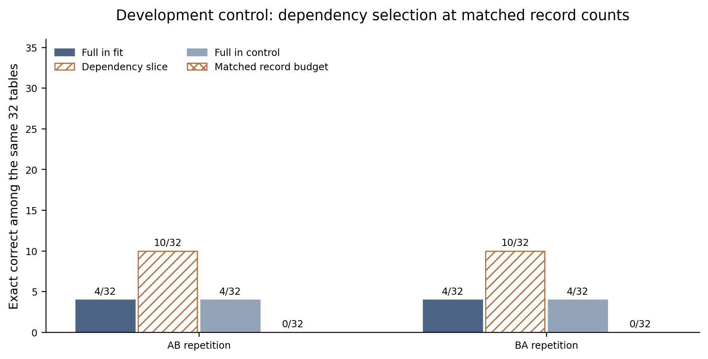
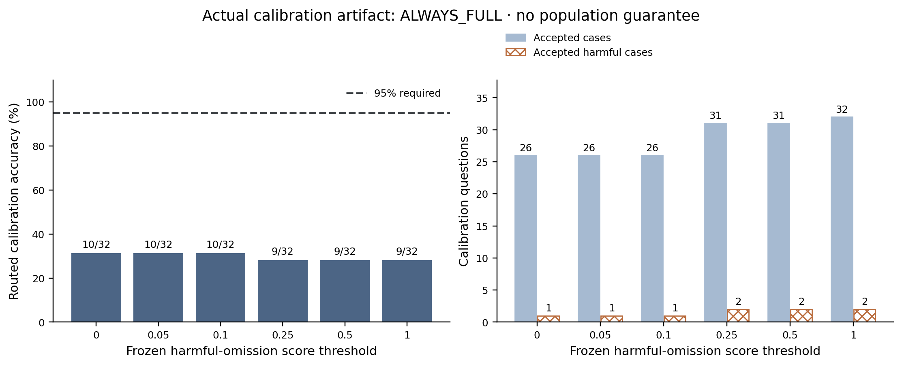

# Actual controller training and matched-record development control

The separately approved negative investigation has completed its three development studies. Its native controller has selected `ALWAYS_FULL` because none of the six frozen calibration thresholds satisfied the unchanged requirements. Fresh confirmation remains pending. This is an observed result of this fitted controller and these tables, with no claim that all learned controllers must fail.

## Fixed design

All three studies use the exact archive04 producer, Qwen2.5-0.5B-Instruct FP16 profile v2, RECORD-LANGUAGE v1, 24 records, concurrency one, two CPU compute threads, no prefix reuse, a 32-token output cap, and two balanced AB/BA repetitions. Fit uses seed 920260811 and calibration uses 920260812. Each split contains 32 tables: 11 direct lookups, 11 reference chains, and 10 update tables. The control repeats the exact fit population, retaining the first N original record lines where N is the dependency-closure size. Equal retained record counts do not imply equal token counts or preserved answers for this deliberately nonsemantic control.

Actual product recipes, proposals and protocols were frozen before label collection. The native training protocol binds both exact recipe identities. A separate read-only interpreter reconciles every offered output with the product report; fit and calibration record-body hashes are disjoint. Label collection retains all four correctness classes. Each arm is labeled correct only if it is correct in every repetition; its cost label sums actual dispatch-to-completion request times. No Qwen weights are trained or changed.

## Complete development outcomes

Each column describes one complete 32-table population in each repetition; AB and BA give the same correctness classifications.

| Outcome | Dependency fit | Dependency calibration | Matched-record control |
| --- | ---: | ---: | ---: |
| Both correct | 2 | 2 | 0 |
| Full correct, candidate wrong | 2 | 2 | 4 |
| Full wrong, candidate correct | 8 | 7 | 0 |
| Both wrong | 20 | 21 | 28 |
| Full correct / offered | 4/32 | 4/32 | 4/32 |
| Candidate correct / offered | 10/32 | 9/32 | 0/32 |
| Observed full/candidate union | 12/32 | 11/32 | 4/32 |
| Enclosing native execution, seconds | 208.324 | 209.725 | 212.399 |

The fit slice succeeds on ten tables where a control with the same retained record count succeeds on none. The independent interpreter finds that the prefix control preserves the original symbolic answer on 0/32 tables, so its failure is unsurprising in this sample. This contrast shows the consequences of retaining the dependency information against this specific prefix control; it is not evidence for a new model-specific selection method. The prefix control is intentionally not symbolically equivalent. It does not establish a token-matched comparison, superiority over every other shortening policy, or useful absolute task quality. Control prompts total 3,374 native tokens per attempt versus 3,368 for dependency slicing. Request-level control-minus-slice differences range from −2 to +3 tokens, and 12/32 budgets match exactly, in both repetitions. Neither policy approaches the 95% requirement. Both-wrong outcomes stay in the denominator.

Exact correctness also differs from served work meeting latency targets. Qualification requires a successful exact answer, observed time to first token at most 15 seconds, and end-to-end latency at most 30 seconds, measured from arrival. With all 32 arrivals simultaneous, fit qualifies 0 full and 4 sliced requests per repetition; calibration qualifies 2 full and 4 sliced requests; the matched-record control qualifies zero in either arm. Descriptive goodput divides these counts by the complete service envelope. It does not override the unchanged absolute quality floor or turn a completed but wrong request into useful work.

## Actual fitted controller and calibration

The native product fits a binary harmful-omission tree of maximum depth two, using Gini impurity and five prompt-derived features: total records, dependency-closure records, overwritten writes, and the minimum and maximum retained record position in permille. The features do not expose keys, values, answers, seeds or workload-family labels. Fit labels include only two harmful omissions, which sharply limits evidence about rare harm.

The fitted root splits on minimum retained position at 826 permille. Its children split on maximum retained position at 478 and 869 permille. Its four leaves contain 5, 24, 1 and 2 fit tables, respectively, with 1, 0, 1 and 0 observed harmful omissions. These are fitted empirical scores, not risk bounds.

The frozen threshold grid is 0, 0.05, 0.1, 0.25, 0.5 and 1. A feasible threshold must accept at least eight calibration tables, accept zero observed harmful omissions, obtain at least 95% routed calibration accuracy, and save positive summed request time. Among feasible points the rule selects maximum savings, breaking ties by the lowest threshold. If none qualifies, the registered result is `ALWAYS_FULL`.

| Thresholds with identical results | Accepted / 32 | Harmful among accepted | Routed correct / 32 | Request-time saving, seconds | Eligible |
| --- | ---: | ---: | ---: | ---: | --- |
| 0, 0.05, 0.1 | 26 | 1 | 10 | 52.469 | No |
| 0.25, 0.5 | 31 | 2 | 9 | 63.710 | No |
| 1 | 32 | 2 | 9 | 65.934 | No |

Even the zero-score leaf rule accepts one genuinely harmful calibration omission. It also accepts 17 jointly wrong cases. Those cases are not harmful relative to full context, but they make the absolute quality floor unattainable for this selected rule. This distinction explains why a harm score alone is insufficient as an absolute-quality certificate. The complete grid remains in the original controller artifact; no threshold was selected after seeing confirmation outcomes.

The exact controller file SHA-256 is `4eddbc0eb75fe434d08351e045c07921662ba7bde666830ab2bf7566f1c40c91`. The native fitting/calibration core reports 2,326,306 ns, while the full training command takes 0.669451179 seconds and its input label-collection attempts consume 404.045735842 seconds. These are nested or separately defined scopes; the small arithmetic core is not the total cost of learning. Dispatch-to-completion savings in the grid exclude loading, acquisition, source build, label generation and development overhead, so they are not a full-cost gain.

All five native training files are copied byte-for-byte under [publication/artifacts/training](publication/artifacts/training): fit labels, calibration labels, controller, training protocol and training receipt. The portable validator checks the original labels against the actual exported native outcomes and prompt features, reconciles exact cost sums and tree node counts, recomputes every calibration grid entry, and verifies the selected refusal mode. It does not train a replacement model.

## Fresh confirmation boundary

The controller was frozen before the first confirmation population generation. Generation first occurred during construction of the three exact product recipes; that access is logged explicitly. All three recipes were frozen before any confirmation native execution. They use the same 128 new tables, seed 920260813, with 43 lookups, 43 reference chains and 42 update tables. The policies are always dependency slice, a predeclared rule accepting one-record closures with no overwritten writes, and the actual native learned controller. Each receives its own freshly executed full-context baseline and two balanced repetitions. The selection rule and quality gates remain unchanged.

Development keys and values use a D-prefixed namespace; confirmation uses a C-prefixed namespace and a separately derived random stream. This creates deliberately disjoint lexical inputs as well as new table groups. It is an explicit distribution change, so no IID exchangeability or invariance to names is assumed. Calibration refusal already occurs between two distinct development seeds within the D namespace.

Workflow separation is recorded honestly: agents share a Unix identity, so this is not a cryptographic or access-control holdout. No confirmation outcome has been used to choose the grammar, controller, seed, thresholds, records or repetition count. Confirmation results and complete costs will be added only after actual execution and raw audit.

Across the closed 64-request feasibility diagnoses and these three development studies, 448 native offered requests have completed, consuming 1,153.474366823 seconds of enclosing native execution. The final frozen matrix totals 1,984 requests, below the 2,000 cap. Queue waiting counts against the unchanged original deadline but is distinct from native execution. The prospective post-fit 1.5× timing check admitted the remaining fixed matrix; it did not reset either limit.
