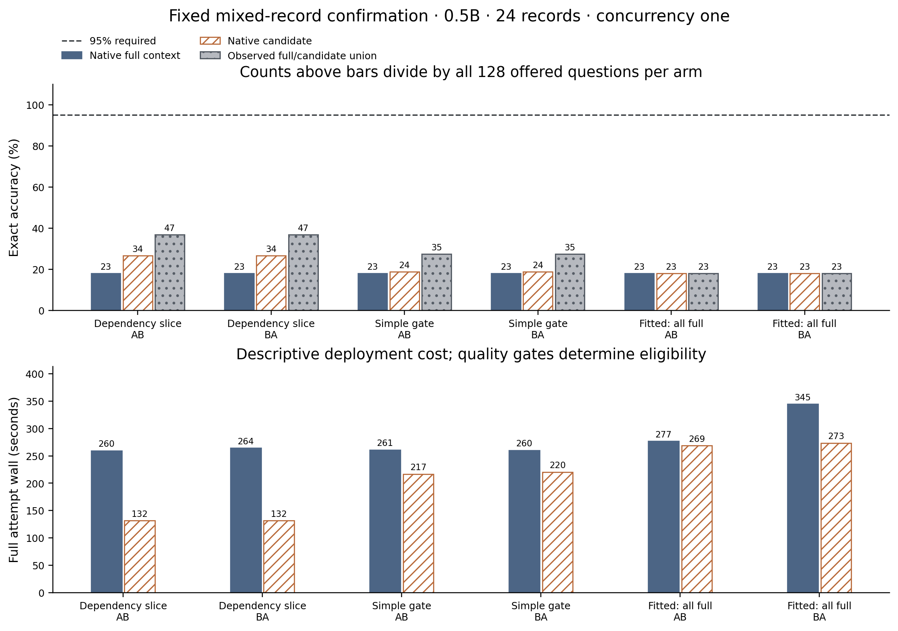
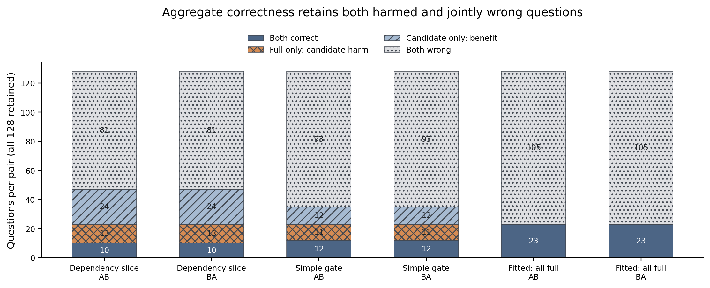
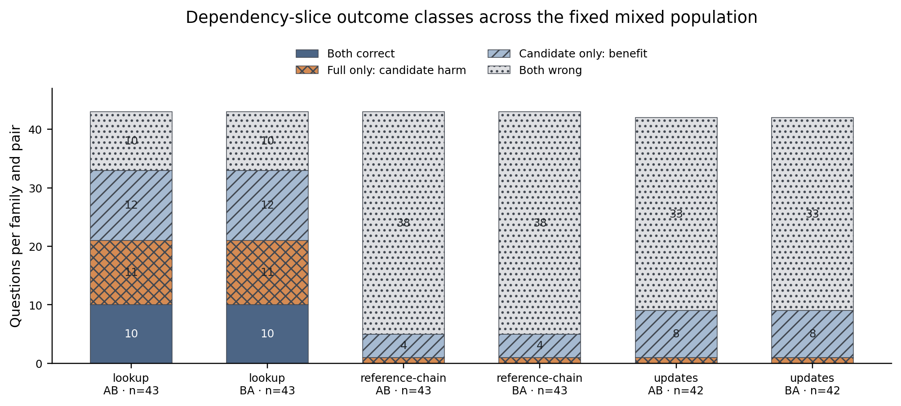

# Symbolic closure preserves task semantics but not native answers: a bounded context-selection investigation

## Abstract

A dependency-closure certificate can preserve a record program's exact answer while changing a model's answer from correct to wrong. We tested this boundary in a bounded native investigation using an authored 24-record language and Qwen2.5-0.5B-Instruct FP16. On 128 fresh mixed-family confirmation tables, full context answered 23/128 correctly and always dependency slicing answered 34/128 in each of two arm-order-balanced repetitions. Their complete paired classes were 10 both correct, 13 harmed by slicing, 24 benefited and 81 jointly wrong. A fixed simple gate scored 24/128, harming 11 and benefiting 12; the fitted controller refused all omissions and scored the same 23/128 as full context. No arm reached the unchanged 95% quality floor. Even a conditional oracle restricted to the observed full/slice outputs reached only 47/128 (36.72%), in each pair and under a conservative repeated-output rule. Slicing reduced prompt tokens and descriptive wall time, but produced no eligible quality-preserving efficiency result.

A separate 32-table fit split and 32-table calibration split produced an actual depth-two harmful-omission controller. Every frozen calibration threshold failed the unchanged 95% routed-accuracy and zero-observed-harm requirements, so the native artifact selected `ALWAYS_FULL`. A matched-record-count development control answered 0/32 correctly, compared with 10/32 for dependency selection on identical tables, in both repetitions; the prefix control also failed symbolic answer preservation on all 32 tables. These results distinguish symbolic validity, model behavior, empirical harm scores and complete cost. They establish neither a new compression architecture nor useful quality-preserving efficiency, and do not bound other models, prompts, controllers or unobserved outputs.

## Scope and relationship to existing work

The scientific question is whether a model-bound acceptance rule can identify symbolically harmless omissions that damage model task success, and thereby improve over always-full, always-slice and a fixed simple gate under a common quality constraint. This investigation uses actual packaged native execution and an original, restricted record language. Its answer can be calculated exactly without a language model. Preserving that answer therefore certifies only program semantics; it does not establish that a model will produce an equivalent answer after omission.

Task-aware learned compression predates this project: [RECOMP](https://arxiv.org/abs/2310.04408) studies compressed context for downstream tasks, [LLMLingua-2](https://arxiv.org/abs/2403.12968) studies learned token selection, and [SLICET5](https://arxiv.org/abs/2509.17338) is close to program slicing and constrained context selection. The authored grammar here is much narrower than ordinary language. [RouteLLM](https://arxiv.org/abs/2406.18665) studies learned quality/cost routing. [Context Codec](https://arxiv.org/abs/2605.17304) discusses structured commitments, checks and fallback; the [Distil technical write-up](https://github.com/dshakes/distil/blob/main/docs/PAPER.md) claims outcome-guided compression and calibrated decisions. Those are primary author or implementation claims, not independent validation by this study. No priority is asserted.

A finite threshold grid is also not formal risk control. [Learn then Test](https://arxiv.org/abs/2110.01052) and [Conformal Risk Control](https://arxiv.org/abs/2208.02814) provide separate methods with assumptions and procedures not established here. The fitted object is a small classical tree. Qwen weights remain unchanged; no conformal or population-risk guarantee is claimed.

## Prospective design and execution

Two earlier positive-advance branches closed under their original admission rules. First, eight RECORD-LANGUAGE v1 reference-chain questions with eight records were evaluated on Qwen2.5-14B-Instruct FP16 using full context and dependency slicing. Each arm needed at least 95% accuracy, which requires 8/8 in this cell, together with no aggregate pair regression and affordable projected cost. Both repetitions instead yielded 1/8 full and 2/8 sliced. Second, a single fixed wording diagnosis on Qwen2.5-0.5B-Instruct kept those same records, query, answers and order while replacing three instruction lines with explicit operand definitions, one unrelated example and a complete-five-letter output instruction. Full v1 gave 1/8 and explicit full v2 gave 0/8 in each repetition. Its 8/8 candidate admission rule also failed. Neither branch authorized further prompt or seed search.

The present negative investigation was separately approved and frozen before collecting its labels. It retains the original v1 grammar and uses Qwen2.5-0.5B-Instruct FP16, corrected admitted profile v2, on an AMD Ryzen 9 7950X Linux x86-64 host, with two CPU compute threads and concurrency one. Every original table contains 24 records. `VALUE key value` assigns a value; `REF key target` refers to the final assignment of another key; later writes replace earlier writes. The query's final reference chain yields an exact five-letter value. Dependency slicing retains precisely the final records required by that query, in their original order, without injecting the resolved answer.

Fit seed 920260811 and calibration seed 920260812 each generate 32 tables: 11 direct lookups, 11 reference chains and 10 update tables. The matched-record control repeats the exact fit population but retains its first N record lines, where N is the dependency-closure size. This control matches record counts request by request, not tokenizer counts or symbolic answer preservation; it can omit an answer-bearing record. It tests this particular prefix-shortening alternative rather than every possible shortening policy.

Confirmation uses 128 fresh tables from seed 920260813: 43 lookups, 43 reference chains and 42 update tables. Three policies receive exactly the same offered tables and settings: always dependency slice; a predeclared rule accepting one-record closures with no overwritten writes; and the actual fitted, calibrated controller. Each policy has a newly executed full-context baseline. Within each study two complete repetitions run in AB then BA order. Policies run sequentially through the shared single-heavy-job queue. This balances arm order within studies but does not create an isolated physical host or randomized order across policies.

Development keys and values use a D-prefixed namespace; confirmation uses a C-prefixed namespace and a separately derived random stream. This creates deliberately disjoint lexical inputs as well as new table groups. It is an explicit distribution change, so no IID exchangeability or invariance to names is assumed. Calibration refusal already occurs between two distinct development seeds within the D namespace.

All native requests use the admitted fixed chat template and runtime settings, a 32-token output cap, simultaneous arrivals, and no cross-request prefix reuse. Quality uses every offered request and an exact stripped-output match. Qualified service additionally requires an observed time to first token of at most 15 seconds and end-to-end latency of at most 30 seconds, both measured from arrival. Goodput divides the number of correct, qualified requests by the full service envelope. A completed native request need not be correct, and descriptive goodput does not override experiment eligibility.

The original 95% absolute accuracy floor and zero aggregate pair quality-regression requirement remain unchanged. The registered throughput and tail criteria are also unchanged. No ineligible timing ratio is promoted to a quality-preserving gain. The negative contract permits at most 1,920 new native requests, or 1,984 including the 64 closed feasibility requests, under the unchanged 2,000-request and 180-minute native ceilings and original allocation deadline. A prospectively specified post-fit timing check projects remaining work at 1.5 times observed execution seconds per offered request; it admitted the fixed remaining matrix without resetting a limit.

## Native learning and calibration

The actual product extracts five features from each original prompt: total record count, dependency-closure count, overwritten-write count, and minimum and maximum retained record position in permille. Neither keys, values, expected answers, seeds nor family labels are features. Native outcome labels keep all four correctness classes. An arm is labeled correct only if it succeeds in every repetition, and its request-cost label sums actual dispatch-to-completion intervals. Fit and calibration record-body groups are disjoint.

The product fits a binary harmful-omission tree of maximum depth two using Gini impurity. Fit contains only two harmful omissions. The selected root splits on minimum retained position at 826 permille; its children split on maximum retained position at 478 and 869. Four leaves contain 5, 24, 1 and 2 tables, with 1, 0, 1 and 0 observed harms. These empirical proportions are not risk bounds.

The frozen calibration grid is 0, 0.05, 0.1, 0.25, 0.5 and 1. Eligibility requires at least eight accepted tables, zero accepted observed harms, at least 95% routed accuracy, and positive summed request-time savings. Among feasible points, maximum savings then the lowest threshold determine selection. No feasible point means `ALWAYS_FULL`.

| Thresholds | Accepted / 32 | Harmful among accepted | Routed correct / 32 | Request-time saving, seconds |
| --- | ---: | ---: | ---: | ---: |
| 0, 0.05, 0.1 | 26 | 1 | 10 | 52.469 |
| 0.25, 0.5 | 31 | 2 | 9 | 63.710 |
| 1 | 32 | 2 | 9 | 65.934 |

Every point fails both the relevant observed-harm constraint and absolute-quality floor. Even the zero-score rule accepts one harmful calibration omission and 17 jointly wrong cases. Jointly wrong answers are not harms relative to full context, but remain failures for absolute task quality. The resulting native controller is `ALWAYS_FULL`, with file SHA-256 `4eddbc0eb75fe434d08351e045c07921662ba7bde666830ab2bf7566f1c40c91`. Its tree, complete split trace, fit and calibration labels, grid, protocol and training receipt are retained unchanged.

The controller was frozen before the first confirmation population generation. That generation occurred during construction of the exact product recipes and is explicitly logged. All three recipes were frozen before any confirmation native outcome. Agents share a Unix identity: this is recorded workflow separation, not a cryptographic or access-control holdout. No confirmation outcome selected the grammar, seed, policy, threshold or repetition count.

## Complete observed outcomes

Counts below apply separately to AB and BA: all per-question correctness classes repeat exactly. Each row retains all 128 offered questions; repetitions do not double the independent table count.

| Native candidate policy | Full correct | Candidate correct | Both correct | Full only: harm | Candidate only: benefit | Both wrong | Observed oracle |
| --- | ---: | ---: | ---: | ---: | ---: | ---: | ---: |
| Always dependency slice | 23 | 34 | 10 | 13 | 24 | 81 | 47 |
| Fixed simple gate | 23 | 24 | 12 | 11 | 12 | 93 | 35 |
| Fitted controller: all full | 23 | 23 | 23 | 0 | 0 | 105 | 23 |

Always slicing improves aggregate exact accuracy from 17.97% to 26.56%, while damaging 13 individually correct answers. Thus aggregate nonregression and per-question harm are distinct. The simple gate accepts the 43 direct lookups and falls back on the other 85 tables; its 18.75% accuracy still includes 11 harmed lookups. The deployed native controller has 128 `IDENTITY` decisions per repetition and 17.97% accuracy. All dependency and gated prompts independently preserve the symbolic answer. Every arm fails the 95% quality floor, including the unchanged full baselines; all product eligibility decisions are false. The learned fallback prevents omission but cannot repair baseline incompetence.

For a pair, the conditional fixed-output oracle marks a question correct if either that pair's full or candidate output is correct. The conservative version marks it correct only if one particular arm is correct in every repetition. It never chooses one arm in one repetition and another arm in another repetition to repair an otherwise inconsistent question. These are offline properties of retained outputs, not measured serving policies.

The full/slice conditional oracle is 47/128 (36.72%); the full/simple oracle is 35/128 (27.34%); the full/fitted oracle is 23/128 (17.97%). Each value holds separately in both repetitions and for the conservative rule. No oracle reaches 95%. For slicing, the mixed population separates as follows:

| Family | Offered | Both correct | Harm | Benefit | Both wrong | Oracle correct |
| --- | ---: | ---: | ---: | ---: | ---: | ---: |
| Direct lookup | 43 | 10 | 11 | 12 | 10 | 33 |
| Reference chain | 43 | 0 | 1 | 4 | 38 | 5 |
| Updates | 42 | 0 | 1 | 8 | 33 | 9 |

These counts also repeat exactly. The direct-lookup oracle is 76.74%, versus 11.63% for reference chains and 21.43% for updates. Removing the harder families would change the prospectively offered population and still would not make the retained lookup outputs meet 95%.

Development outcomes offer context without becoming confirmation evidence. Fit has 2 both-correct, 2 full-only-correct, 8 slice-only-correct and 20 both-wrong cases per repetition; calibration has 2, 2, 7 and 21. Their conditional oracle ceilings are 12/32 and 11/32, respectively, also under the conservative rule. The matched-record control has 0, 4, 0 and 28, and answers 0/32 correctly compared with dependency slicing's 10/32 on the same fit tables. The independent interpreter finds that this prefix control preserves the original answer on 0/32 tables, making its failure unsurprising on this sample. Its native prompts total 3,374 tokens versus 3,368 for dependency slicing per attempt; per-question differences range from −2 to +3 tokens, with 12/32 exact budget matches. The contrast establishes neither a new model-specific selection method, superiority over all shortening alternatives, nor useful absolute quality.

## Concrete native illustrations

The prospectively frozen rule selects `r009`, the first harmful direct lookup in both repetitions: original line `VALUE COWPG CGMSA` with query `ASK COWPG` resolves to `CGMSA`. The full native answer is `CGMSA`; the certified one-record slice answers `COWPG`, copying the key. Both native streams stop at EOS after four generated tokens, including EOS, with neither truncation nor cross-request prefix reuse. Full and sliced prompt counts are 269 and 92 tokens. This is a complete-response error on a direct lookup, without reference indirection or overwrite ambiguity.

The first repeated benefit is `r003`: `VALUE COUKW CAMYD` with query `ASK COUKW` has answer `CAMYD`. Full outputs `COKSW`, while slicing outputs `CAMYD`, both ending at EOS. The selector considered 13 repeated harms, including 11 lookups, and 24 repeated benefits, including 12 lookups; it did not select solely from these two displayed cases. The [harmful case](publication/artifacts/confirmation-illustrations-final/harmful-r009.md), [beneficial case](publication/artifacts/confirmation-illustrations-final/beneficial-r003.md) and adjacent JSON artifacts retain complete prompts, both repetitions, certificates, native stream identities and token-level reconstruction. The [selection receipt](publication/artifacts/confirmation-illustrations-final/selection-receipt.json) binds the pre-execution rule and final manifest.

The earlier 14B development counterexample is distinct: for `r007`, both full and sliced record programs resolve to `DXEDM`, but full native output is `DXEDM` and sliced output is `J` in both repetitions. The 24-record fit example is simpler: `VALUE DDMVJ DRIXT` and `ASK DDMVJ` resolve to `DRIXT`; the full model emits `DRIXT`, while the one-record slice emits the key `DDMVJ`, in both repetitions, each ending at EOS. These examples demonstrate why the deliberately narrow symbolic certificate cannot be extended to a guarantee about model answers. They are not additional independent evaluation samples.

## Complete costs and serving limits

All table entries are actual 128-question attempt totals. Each cell with a slash gives AB / BA; timing is descriptive because every policy fails quality eligibility.

| Study | Full wall, seconds | Candidate wall, seconds | Full / candidate prompt tokens per repetition | Full / candidate generated tokens | Full / candidate qualified count |
| --- | ---: | ---: | ---: | ---: | ---: |
| Always slice | 259.595 / 264.110 | 131.789 / 131.529 | 35,257 / 13,473 | 545 / 550 | 1 / 6 |
| Simple gate | 260.840 / 260.052 | 216.654 / 220.447 | 35,257 / 27,383 | 545 / 550 | 1 / 3 |
| Fitted: all full | 276.704 / 344.615 | 268.619 / 273.295 | 35,257 / 35,257 | 545 / 545 | 1 / 1 |

Dependency slicing removes 61.79% of prompt tokens, while generated tokens rise from 545 to 550 per attempt. The simple gate removes 22.33% of prompt tokens. The learned controller preserves every full input and token count, yet its candidate/full wall ratios differ from one (about 0.971 and 0.793). This observed timing variation with identical prompts prevents attributing its lower candidate time to compression or learning. Sequential policies and shared-host scheduling limit causal timing comparisons.

End-to-end p95 ranges are 245.288–249.460 seconds for the slice study full arms and 122.995–123.011 for slice; 245.299–246.520 for the simple study full arms and 204.230–207.837 for the gate; 262.341–325.787 for the fitted study full arms and 253.033–257.571 for its identical-input candidates. Arrival-based qualified counts are only 1/128 for each full arm, 6/128 for slice, 3/128 for simple and 1/128 for fitted. These low service fractions and failed absolute accuracy are retained alongside all timing values.

The slice, simple and fitted confirmation archive-process executions, excluding queue wait, take 800.030817060, 972.520437157 and 1,178.974084709 seconds. The last retained producer allocation observation is 31,200.174988555 seconds (8.67 hours) since the original allocation start, including earlier work, development and waiting; this is not a native-only total. Detailed, overlapping timing scopes remain in [cost-scopes.csv](publication/tables/final/cost-scopes.csv).

The two closed branches consumed 523.025664774 seconds of archive-process execution, excluding queue wait. Fit, calibration and the matched-record control consumed 208.324388002, 209.725240862 and 212.399073185 seconds. The actual fitting/calibration core reports 0.002326306 seconds, while the whole training command takes 0.669451179 seconds and its input label-collection attempts take 404.045735842 seconds. The arithmetic core is not the total cost of learning. Calibration savings use dispatch-to-completion intervals and omit loading, acquisition, build and development overhead, so they are not full-cost gains.

Observed memory is available for every retained attempt. Across 28 attempts in seven 0.5B studies, owned-server VmHWM ranges from 1,370,996,736 to 1,387,741,184 bytes (1.371–1.388 decimal GB), and sampled server-plus-coordinator RSS maxima range from 1,443,123,200 to 1,469,255,680 bytes (1.443–1.469 GB). Across the four retained 14B feasibility attempts, the corresponding ranges are 30,060,847,104–30,068,473,856 bytes (30.061–30.068 GB) and 30,135,410,688–30,143,115,264 bytes (30.135–30.143 GB). Every study configures a 60,000,000,000-byte (60 GB) memory limit. Server VmHWM excludes the coordinator; sampled aggregate RSS is neither a continuous peak nor whole-host or allocation-wide memory. These observations do not rule out unsampled transient peaks, and accelerator memory is unmeasured. The [per-model memory and timing summary](publication/tables/final/memory-and-timing-summary.json) retains all 32 attempt values, exact bytes, model identities, limits and source-file hashes.

The 4,104.999705749-second native total and each study total count only archive-process execution: receipt `finished_ns` minus `execution_started_ns`. They exclude 5,985.136430989 seconds of separately retained shared-queue waiting, computed as `execution_started_ns` minus `started_ns` across the eight studies. Queue waiting remains charged inside the original allocation's elapsed time. The legacy `queue_execution_s` column in the reproduced cost table means this archive-process interval, not waiting time; the linked summary makes both intervals explicit for every study.

Full attempt wall includes verification, loading, prompt preparation, serving and shutdown; archive-process execution also encloses orchestration around those attempts and excludes waiting for the shared queue. These scopes overlap and are never added together. End-to-end and time-to-first-token tails include request waiting under simultaneous arrivals. Original-allocation accounting separately charges elapsed development, earlier work, queue waiting and idle time through the last retained producer observation. Its totals already contain study intervals and cannot be added to their sums. Historical setup ancestors retain their own failure/interruption and acquisition records without being silently treated as free. Monetary, energy and thermal observations are unavailable; no values are inferred from CPU specifications.

The closed 14B slice uses 864 prompt tokens per eight-question attempt versus 1,184 for full context, and generates 21 versus 54 tokens. Wrong shorter answers therefore contribute to its lower descriptive wall time. The wording diagnosis raises prompt tokens from 1,184 to 1,664 and generated tokens from 36 to 51 while reducing accuracy. Its candidate/full wall ratios are 1.512 and 1.423. Neither is an eligible efficiency result.

## Limits, rights and reproduction

The original candidate campaign completed eight studies and 32 native attempts, totaling 1,984 offered requests and 4,104.999705749 seconds (68.42 minutes) of archive-process execution, excluding queue wait. It includes 200 unique original record tables: eight shared by the two closed diagnoses, 32 fit, 32 calibration and 128 shared across all confirmation policies. Development, repeated attempts and reused policy populations are not extra independent confirmation samples. All original native requests completed before the unchanged deadline and within the 2,000-request and 180-minute ceilings. The complete [final tables](publication/tables/final/analysis.json), including requests, paired outcomes, route counts, repetition stability, oracle strata and cost scopes, preserve every offered observation.

Repeated attempts on the same questions are not independent tasks. This authored grammar, fixed seeds, checkpoint, greedy runtime and shared CPU environment constrain transfer. The simple gate and fitted tree do not exhaust possible controllers, and a fixed-output ceiling does not constrain newly generated outputs, other instructions, other models or arbitrary natural language. No significance test, population confidence interval, universal harm guarantee or new architecture is asserted. A full-context fallback preserves the original input; it cannot repair a baseline that fails the task.

Both admitted Qwen checkpoints declare Apache-2.0 at their pinned official repositories. The pinned llama.cpp backend is MIT, with a retained local patch. The original generated record tasks and project work are distributed under AGPL-3.0-only; exact source notices, model/backend identities and acquisition receipts accompany the evidence. Model weights are excluded and acquired separately. No external participants, institutional endorsement or independent human evaluation is claimed.

The 14B feasibility producer SHA-256 is `f90c48dd0be36b29c3188c365ba6b8ab2cbe709897cd7f4cce0e4825a147db6f`; all other studies use archive04 `5f1aabf84635e33dd166ee656d5bcb5830f25a5f4f5d68433e2fd3e4498fb986`. The final reader/runtime can differ in presentation; exact original producer bytes and native evidence are retained. The [portable rerun guide](PUBLICATION-RERUN.md) uses the stable [final evidence manifest](publication/evidence-manifest-final.json), actual exported derivatives and exact producer files without developer cache paths or code-constant edits. Standard-library analysis independently resolves original and selected prompts, checks complete offered inventories, reconciles quality and qualified-service counts, and retains every paired outcome class. It verifies policy population equality, body-group separation, equal control record budgets and the actually deployed controller. A separate validator reconciles all native labels, fitted node counts and every calibration point without fitting a replacement. Standalone Matplotlib PNG, SVG and PDF figures derive from those reproduced tables; actual PNGs and PDF renders are visually checked.

This manuscript reports the original observations and the completed portable recomputation of those retained outputs. A separately assigned skeptical native reproduction, if performed, must retain its own request inventory, settings, provenance, costs and disagreements; it is not included in the original 1,984 requests or presented here as already completed. Its final report should be read alongside this manuscript.
