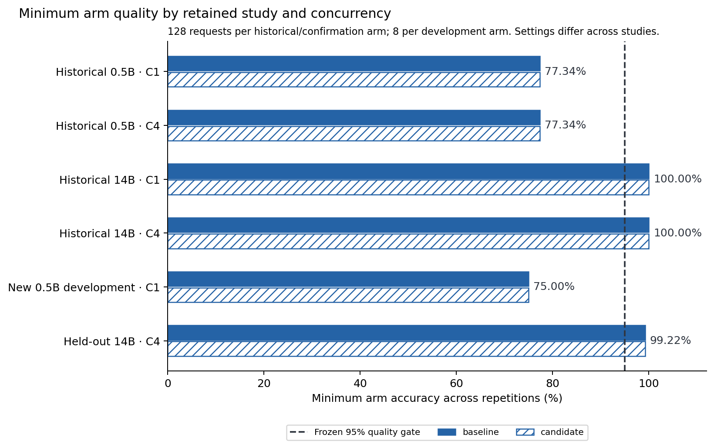
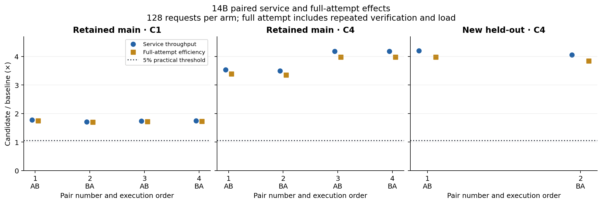
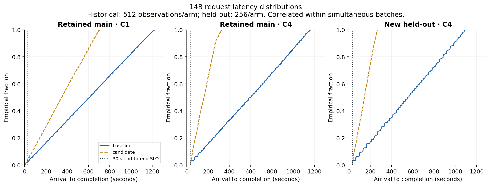

# Prefix reuse with frozen quality and cost gates: retained evidence and a held-out 14B confirmation

Lean Model Lab · 8 September 2026 · local benchmark revision

**The held-out 14B batch study produced a 4.123× median service-throughput ratio, while each arm qualified 0/256 responses under the joint 15-second TTFT / 30-second end-to-end SLO.** Charging verification, process start/load and other attempt overhead reduced the median efficiency ratio to **3.912×**. Every arm answered 127/128 questions exactly and both paired token-parity checks passed. This supports the frozen quality-constrained batch-efficiency claim on this workload and shared CPU host. It does not support an interactive-serving SLO claim or an all-allocation cost-saving ratio.

The study contains **128 unique new questions repeated in four arms, yielding 512 observations**. It is not 512 independent questions. One question was wrong in every arm: `r110`, expected `GNOSP`, returned `SPNOG`. The frozen 95% accuracy gate was met at 99.21875%; neither the error nor the threshold was changed after observation. Separate skeptical native reproduction and external human review remain pending.

## Question, prior art and design

The question is whether observed same-slot prefix reuse remains an efficiency result after adequate absolute task quality, exact output parity, tail behavior and complete costs are checked. KV-cache reuse is a known technique; SGLang describes reuse through RadixAttention, whereas this experiment isolates a narrower llama.cpp cache switch. The Qwen2.5 technical report establishes the model family, not task accuracy on our generated key-copy prompts. [SGLang](https://arxiv.org/abs/2312.07104), [Qwen2.5 technical report](https://arxiv.org/abs/2412.15115).

The completed original benchmark package remains unchanged. Its retained 14B main study used 128 key-copy prompts, four AB/BA/AB/BA pairs at each of concurrency one and four, and the frozen `0.4.0.dev0` producer. It followed known development/recovery evidence and did not constitute untouched confirmation. The historical 0.5B comparison and the later stopped 0.5B development branch also remain unchanged. This revision adds one distinct prospective 14B confirmation rather than replacing those observations or reopening the 0.5B search.

Root selected the new fixed seed `2026090901`. The [protocol and freeze](protocol.json) preceded generation of the new v2 recipe/workload. There were 128 requests per arm, concurrency four, two balanced AB/BA pairs, simultaneous arrivals, twelve compute threads, a 32-token output ceiling and no additional cases. Twelve threads match the historical 14B setting and were explicitly authorized within the original twelve-thread/one-heavy-job envelope. Every new server's recorded affinity was logical CPUs 0–11. No model, backend, template or other engine setting changed. The newer producing archive was explicitly frozen and its identity is reported separately below.

Within a pair, baseline and candidate shared the checkpoint, actual prompt tokens, offered requests, sampling and CPU settings. Baseline set `cache_prompt=false`; candidate set it true. The frozen gates required at least 95% exact answers in both arms, no pairwise aggregate quality loss, exact input/output token parity, at least 5% service and full-attempt efficiency gain, and no greater than 10% p95/p99 regression for TTFT or end-to-end latency. Joint exact-answer/SLO qualification remained a separate reported serving constraint. The native v2 evaluator applies its original service criterion; the additional full-attempt criterion was prospectively specified in this follow-up protocol and independently evaluated.

The post-run split audit found 128 distinct full prompts and zero full-prompt overlap with the historical 128-question main population. The filler prefixes and grammar intentionally remained shared. This is conventional prospective isolation using a new fixed seed and frozen implementation, under the same Unix identity. It is not adversarially hidden data, a new task family, an independent machine or external human validation. No interim outcome selected a seed, parameter, case or replacement run.

A symbolic key extractor can solve this restricted, project-authored task without an LLM. It is the non-LLM task floor; no symbolic timing comparison was measured here. These generated records exercise the declared cache and quality contracts, rather than establishing general language competence.

## Quality and exact differences

| Study | Unique question population | Repeated observations | Exact answers per arm | Paired output parity | Interpretation |
| --- | --- | --- | --- | --- | --- |
| Retained 14B main | 128 | 2,048 | 128/128 | 8/8 pairs | Quality-valid historical benchmark; development history disclosed |
| New held-out 14B, C4 | 128 | 512 | **127/128** | **2/2 pairs** | Prospective quality/cost/tail gates pass; one wrong question persists |
| Historical 0.5B comparison | 128 | 1,536 | 99/128 | C1: 3/3; C4: 0/3 | Ineligible; original 95% and parity failures retained |
| New 0.5B development | 8 | 32 | 6/8 | 2/2 pairs | Frozen feasibility stop; its confirmation remains unstarted |

The interrupted historical protocol attempt additionally retains 30 failed observations out of 128 offered, with 98 missing and no candidate pair. It is not included as a completed comparison. Across the five supplied inventories, the publication tables retain 4,158 observed responses, 4,256 offered requests, 37 attempts and 18 recorded pairs.

In both held-out pairs, 127 question comparisons were correct→correct and one was wrong→wrong. There were zero correct→wrong or wrong→correct transitions and zero paired output-token differences. All four `r110` responses were `SPNOG`, with token IDs `[4592,8996,38,151645]`, including EOS; the expected answer remained `GNOSP`. These are four observations of the same wrong question, not four distinct failures in the sampled population. Nothing in the parity result proves that the model is always correct.

The historical 0.5B contrast demonstrates the complementary problem. Every pair retained 99 correct→correct and 29 wrong→wrong comparisons, yet five pair/request observations changed output tokens at concurrency four: `r108` and `r121` in pairs 0 and 1, and `r121` in pair 2. Their outputs alternated between `river` and `river stone cloud field tree path light water`; both were wrong. Thus aggregate accuracy equality concealed non-equivalent outputs, while parity at concurrency one preserved inadequate accuracy. The stopped 0.5B development branch likewise preserved two wrong answers per arm despite exact parity. [All observed requests](publication/requests.csv), [exact historical token differences](publication/output-differences.csv).

## Paired effects, tails and serving limits

| Held-out C4 measure | Pair 1: AB | Pair 2: BA | Median / scope |
| --- | ---: | ---: | --- |
| Service throughput, candidate/baseline | 4.194850× | 4.051410× | **4.123130×** |
| Full-attempt efficiency, candidate/baseline | 3.977620× | 3.845723× | **3.911671×** |
| End-to-end p95, candidate/baseline | 0.237750 | 0.245753 | 0.241752 |
| End-to-end p99, candidate/baseline | 0.240577 | 0.245054 | 0.242815 |
| TTFT p95, candidate/baseline | 0.237214 | 0.244783 | 0.240999 |
| TTFT p99, candidate/baseline | 0.237168 | 0.242983 | 0.240075 |
| Joint exact-answer + 15s TTFT + 30s completion | Baseline 0/128; candidate 0/128 | Baseline 0/128; candidate 0/128 | **Baseline 0/256; candidate 0/256** |

Both observed pairs pass the predeclared practical-effect and relative-tail criteria. These two values define the descriptive ranges; their median is the midpoint of the two observations. There is no confidence interval or significance claim. Full-attempt efficiency divides baseline elapsed attempt time by candidate elapsed attempt time because offered and successful work are equal; it is not a setup-amortized allocation ratio. Successful service throughput includes the one wrong but operationally successful response per arm, whereas joint SLO goodput requires an exact answer as well as both latency targets.

The retained main study's service medians were 1.740× at C1 and 3.857× at C4, with full-attempt medians 1.720× and 3.680×. The new result is consistent in direction with that device-specific benchmark. Different seeds, producer builds and elapsed host conditions prevent assigning the difference in ratios to the seed alone. The historical 0.5B used two compute threads, different model/binary/producer settings and partially counterbalanced AB/BA/AB order; its comparison with 14B is not a controlled scaling law. Ineligible 0.5B ratios remain null.

In the held-out study, baseline service rates were 0.11812 and 0.11800 successful requests/s; candidate rates were 0.49550 and 0.47805. Baseline end-to-end p95 values were 1,040.46 and 1,050.22 seconds; candidate values were 247.37 and 258.10 seconds. P99 values were 1,068.28 and 1,084.18 versus 257.00 and 265.68 seconds. All arrivals occurred together, so these include the growing queue and imply no finite offered requests-per-second rate.

Dispatch-to-completion p95 was 44.07 and 38.74 seconds in the baseline, versus 9.22 and 14.67 seconds in the candidate. Candidate dispatch-to-completion p99 remained 31.99 and 32.78 seconds. Those dispatch metrics do not replace arrival-based SLOs. **Both arms qualified 0/256 responses jointly**, despite the service-throughput gain.

Native raw accounting found 22,281 prompt tokens per arm. Baseline reused none; each candidate reused 20,212 and newly evaluated 2,069. Each arm generated 523 tokens, including the identical wrong answer. These are token-accounting observations, not measured FLOPs or energy. Owned-server VmHWM ranged from 31.322 to 31.327 decimal GB; sampled server-plus-coordinator peak reached 31.433 GB. Neither measure establishes an exclusive physical-memory footprint or continuous allocation-wide peak. Prequeue host load was 6.04/4.28/5.27; the additional 45-second operational snapshots reached a maximum observed load-average value of 23.61. The host was shared, with no thermal, energy, monetary or retained CPU-time sensor measurement.

## Startup, history and complete clocks

The four full-attempt envelopes total **2,769.371 seconds**, compared with **2,694.487 seconds** of service. The 74.884-second difference includes repeated verification of 58.415 seconds, server start/load through readiness of 10.693 seconds, prompt/cache preparation of 2.351 seconds, shutdown/recovery accounting of 2.950 seconds and 0.476 seconds unattributed within attempts. The separate startup bucket is zero because process launch/readiness is recorded under load; startup was not free. Warmup was disabled and OS caches were not cleared.

This measured overhead is already amortized over the four 128-request arm batches in the full-attempt ratios. No alternative batch size or speculative future reuse count is used to improve the result. It does not amortize acquisition, development or the common allocation over a hypothetical deployment lifetime.

The queued process waited **90.012 seconds** before archive execution. Archive-process execution consumed **2,774.945 seconds (46.249 minutes)**; queue-to-finish consumed **2,864.958 seconds (47.749 minutes)**. These envelopes contain the attempt work and are not additive. The conservative 90-minute timeout included waiting, and the original allocation deadline was unchanged. Exactly 512 additional native requests ran once; together with the stopped 32-request development branch, this investigator executed 544 new native requests. There were no new native failures or replacement runs. The four wrong observations remain scientific adverse evidence.

The confirmation report inherits **16,519.173 seconds** of supplied setup and prior-study work; this is not new acquisition for this follow-up. At the last native producer observation, the original allocation clock had consumed **23,941.147 seconds (6.650 hours)**. Setup plus attempt intervals accounted for **19,288.544 seconds**, with **4,652.603 seconds** of intervening coordinator/development/idle time. These are overlapping views of the same clock, not totals to add together. The earlier 0.1 acquisition/build/protocol-failure ancestry is separately disclosed and excluded from the current allocation total; already incurred historical costs are not zero.

The unchanged earlier evidence retains two failed 0.5B builds, the interrupted initial client/protocol attempt, intentional recovery interruptions and their replacements, the profile-size admission failure, and the stopped 0.5B quality branch. The [original manuscript](../manuscript.md) and [methodology](../methodology.md) retain their details and original cost cutoffs. No favorable replacement or erased parity failure underpins the present result. Later report/export/plot/review work consumes the current common allocation while leaving native producer clocks frozen. The activity receipt records its later local snapshot; an all-allocation savings claim is unavailable.

## Provenance, portable reanalysis and readiness

The new producer is archive04 `1.0.0.dev0`, SHA-256 `5f1aabf84635e33dd166ee656d5bcb5830f25a5f4f5d68433e2fd3e4498fb986`, implementation `18c28e8075ebc9e5651bf4e0a66c2fca332480b4834a7342fc49d43775a9ab32`. The exact recipe identity is `73037e93588c07f1968085b0933330bacaaf13ec093d0d39cc63318344823800`. The official Qwen2.5 14B FP16 checkpoint, eight shard hashes, MIT llama.cpp revision and retained compatibility patch are unchanged from [the build/rights inventory](../rights-and-build.md). Project code and generated records remain AGPL-3.0-only; official model profiles declare Apache-2.0. Weights and backend binaries are excluded from study exports.

The actual new derivative preserves all 512 observations and the adverse answer. Export changed 516 raw files for permitted operational-path redaction, so its raw bytes are not identical to the private original. Report SHA-256 is `c3bd5b569b424d1b14fd83471a2e4cec9a0db13b4e452fedbd998da2f990c478`; provenance SHA-256 is `14331f95ddb5d0448507f9da6cad3424dcb119db22716078abe35468f4a82d9f`. Native inspection, report, workbench, raw audit and export all completed. The raw audit returned PASS, and independent derivation agreed with every observed correctness count and token-mismatch list.

[Portable reanalysis](PORTABLE-REANALYSIS.md) accepts an explicit evidence manifest and a new output directory. It was exercised on all five actual exported derivatives with fresh audits, relative paths, an unrelated working directory and available exact producer archives. All 37 attempt metric records matched original-native reanalysis. It uses no private `.cache` constants, does not require changing code, and does not extend historical clocks using the reanalysis machine's monotonic time. One unsuccessful analysis invocation selected system Python by resolving a virtual-environment symlink; its missing-Matplotlib failure and partial output remain retained. Correcting the invocation did not rerun a model or replace observations.

The final PNGs and rendered PDF pages were visually inspected. Paired effects use discrete offset circle/square marks, actual pair/order labels, a shared scale and the 1.05 reference, with retained-main and held-out panels clearly separated. Source-relative hashes bind the figures to their exact CSV inputs, rendering script and evidence manifest. Hash agreement establishes local consistency, not producer authentication or an independent attestation.

This package is ready for separate skeptical reproduction and integration review. It remains unpublished. Two held-out pairs on one shared host cannot establish universal speedups, significance, general language competence, model-training progress, interactive-service SLO compliance or complete allocation savings.
