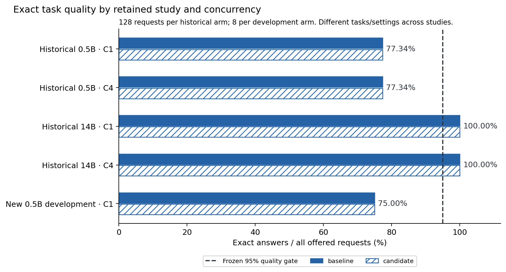
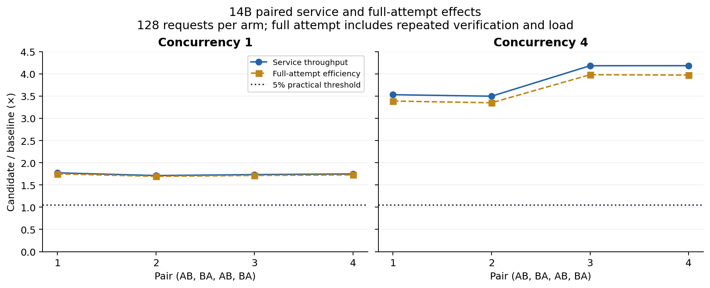
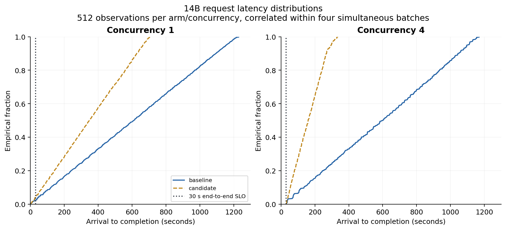

# Prefix reuse under quality, parity and complete-cost constraints

Lean Model Lab · local benchmark and negative contrast · 8 September 2026

**Classification:** device-specific measured benchmark with retained adverse history and a prospectively stopped development control. Separate skeptical reproduction, external researcher review and publication are pending. This draft makes no novelty, model-training or general-language claim.

Native prefix reuse supported a quality-valid batch-efficiency result in the retained Qwen2.5 14B experiment: all 2,048 offered responses were exact, and all eight paired comparisons retained identical input and output token IDs. Candidate/baseline service-throughput ratios had medians of 1.740 at concurrency one and 3.857 at concurrency four. Charging each attempt's verification, process load and other overhead reduced the corresponding efficiency medians to 1.720 and 3.680. The historical 0.5B comparison remained ineligible: every arm scored 99/128, and three concurrency-four pairs failed output parity. A new, separately frozen 0.5B lookup feasibility cell scored 6/8 in every arm despite exact paired token parity, triggering its stopping rule. These observations support a narrow distinction: observed reuse, identical outputs, adequate task quality, reduced elapsed cost and useful service latency are separate requirements.

The inquiry builds on known inference mechanisms. SGLang describes KV-cache reuse through RadixAttention in a structured language-program runtime; the present study tests a much narrower same-slot llama.cpp cache switch and does not reproduce SGLang's system or performance claims. The Qwen2.5 technical report documents the checkpoint family; its broad evaluations do not establish accuracy on this locally generated grammar. [SGLang](https://arxiv.org/abs/2312.07104), [Qwen2.5 technical report](https://arxiv.org/abs/2412.15115).

## Evidence and comparison contract

The 14B study was produced by the frozen `0.4.0.dev0` measurement archive, SHA-256 `5ae4372aa38b68dbe4a198e431602b1e98a127727020bcb666b10d1af29d497f`; implementation `a6b3eb37382d4eec4325d1f5ad85c233a15a1b2d252acaa9a2a36fa5586d44fe`. It was subsequently inspected here using the v1 development archive03, SHA-256 `f90c48dd0be36b29c3188c365ba6b8ab2cbe709897cd7f4cce0e4825a147db6f`. Inspection does not change its producer or upgrade its protocol version. See [exact identities and rights](rights-and-build.md).

Within each 14B pair, the official FP16 checkpoint, actual prompt token IDs, greedy sampling, output ceiling, offered requests, CPU settings and arrival schedule were identical. Only `cache_prompt` changed. The study used 128 synthetic key-copy prompts in four filler-length strata, concurrency one and four, and four AB/BA/AB/BA pairs per concurrency. All arrivals were simultaneous; there was no finite offered requests-per-second estimate because the arrival span was zero. Each arm started a new server, with twelve compute threads and CPU affinity limited to twelve logical CPUs on an AMD Ryzen 9 7950X. Fresh processes did not clear the OS page cache.

The frozen historical quality rule required at least 95% exact answers in both arms and matching paired output tokens; observed pair-level task accuracy must not decline. Practical service gain was at least 5%, with no greater than 10% p95/p99 tail regression. The present full-attempt calculation is a stricter **retrospective cost analysis**, not a claim that the old schema froze the newer v3 primary cost criterion. No quality threshold or failed parity result was changed.

Historical 0.5B ran two compute threads and three AB/BA/AB pairs per concurrency. That order is only partially counterbalanced, even though its legacy evaluator accepts the declared schedule. The two historical checkpoints used different seeds, binaries, thread counts and producer versions. The new v3 record-lookup task also differs from historical filler/key copying. Comparisons across these studies establish contrasts, not a controlled model-size scaling relationship.

The 14B measurement followed known development and recovery evidence. Its preceding development population used the same seed with eight requests, and its history was not technically protected confirmation. The [historical protocol](../../decisions/14b-measurement-recipes-01.md) and [development history](../../results/14b-development-20260908.md) remain part of interpretation.

## Task quality and exact output differences

| Evidence | Offered / observed responses | Exact answers in each arm | Pairwise output parity | Conclusion |
| --- | --- | --- | --- | --- |
| Historical 14B | 2,048 / 2,048 | 128/128 | 8/8 pairs pass | Quality-valid local measurement |
| Historical 0.5B comparison | 1,536 / 1,536 | 99/128 | C1: 3/3 pass; C4: 0/3 pass | Ineligible; 95% gate and parity failures retained |
| Historical protocol failure | 128 / 30 | No validated successful request | No candidate pair | Interrupted, 98 missing; ineligible |
| New 0.5B development | 32 / 32 | 6/8 | 2/2 pairs pass | Feasibility stopped; no confirmation |

The request-level comparison is more specific than aggregate accuracy. Every 14B pair contained 128 correct→correct transitions and no correct→wrong or wrong→correct transitions. Every historical 0.5B pair contained 99 correct→correct and 29 wrong→wrong transitions, also with zero harmful or beneficial exact-answer transitions. Nevertheless, five pair/request comparisons changed output tokens:

| Historical 0.5B, C4 | Request / expected | Baseline text | Candidate text |
| --- | --- | --- | --- |
| Pairs 0 and 1 | `r108` / `XTIQG` | `river stone cloud field tree path light water` | `river` |
| Pairs 0, 1 and 2 | `r121` / `BQSBI` | `river` | `river stone cloud field tree path light water` |

All five were wrong→wrong. Thus unchanged accuracy concealed output non-equivalence. Conversely, parity at concurrency one preserved inadequate accuracy. The short output had token IDs `[5469,151645]`; the long output had `[5469,9798,9437,2070,4916,1815,3100,3015,151645]`. EOS is included. The cause of divergence was not isolated; a numerical or scheduling explanation remains a hypothesis. [Exact difference table](output-differences.csv) and [all request observations](requests.csv) retain each result.

The new development scenario was selected before its native execution: corrected 0.5B profile v2, `record-lookup`, context eight, seed 830091, two threads, concurrency one, two AB/BA pairs, eight requests per arm. A prospective freeze required 8/8 and exact parity in all arms before proceeding to a distinct confirmation seed 830129. Each arm instead returned `DKYYS` for `r001` (expected `DDBKS`) and `DDWIR` for `r007` (expected `DXIGG`). Both pairs had six correct→correct and two wrong→wrong transitions with no output differences. The proposed 128-request confirmation is **UNSTARTED**; there was no alternate seed/family search. This is a development stopping observation, not a confirmation estimate of 75% population accuracy. [Prospective protocol](protocol.md), [decision receipt](decision.json).

## Within-model efficiency, tails and memory

Native accounting found zero reused input tokens in every 14B baseline. Each candidate arm reused 12,740 tokens at concurrency one and 20,215 at concurrency four, out of 22,278 prompt tokens per arm. Those are observed same-slot reuse counts, not modeled FLOPs or energy. The small model also reused prefixes while failing the quality gate: 12,740 tokens per historical C1 arm, 20,213 per historical C4 arm, and 492 per new development candidate arm. Therefore reuse accounting cannot establish task suitability.

| 14B paired measure | C1 median [minimum, maximum] | C4 median [minimum, maximum] |
| --- | --- | --- |
| Service throughput, candidate/baseline | 1.740 [1.711, 1.772] | 3.857 [3.496, 4.183] |
| Full-attempt efficiency, candidate/baseline | 1.720 [1.693, 1.750] | 3.680 [3.349, 3.980] |
| End-to-end p95, candidate/baseline | 0.575 [0.564, 0.586] | 0.257 [0.233, 0.283] |
| End-to-end p99, candidate/baseline | 0.575 [0.564, 0.585] | 0.261 [0.238, 0.285] |

All eight eligible pairs exceed the 5% practical gain threshold and avoid the declared tail regression limit. Full-attempt efficiency equals baseline elapsed attempt time divided by candidate elapsed attempt time because offered and successful work are equal. It does not charge shared acquisition twice or estimate a counterfactual allocation without research overhead. Ineligible 0.5B efficiency ratios remain null in the machine-readable results. Its raw per-arm throughput and latency remain available as descriptive observations in [attempts.csv](attempts.csv).

The relative gains did not establish acceptable serving latency. Across four C1 arms, baseline end-to-end p95 ranged from 1,141.4 to 1,165.5 seconds and candidate p95 from 647.7 to 670.9 seconds. At C4 those ranges were 1,062.3–1,130.9 and 257.3–319.6 seconds. P99 ranges were 1,189.9–1,214.2 versus 675.5–701.3 seconds at C1, and 1,110.3–1,169.7 versus 269.4–333.6 seconds at C4. These arrival-to-completion values include the batch queue. Dispatch-to-completion p95 was much lower: 15.28–15.73 versus 8.18–8.45 seconds at C1 and 43.39–48.62 versus 9.94–15.62 seconds at C4.

Only 8/512 baseline and 12/512 candidate C1 requests met both 15-second TTFT and 30-second end-to-end SLOs with an exact answer; both C4 arms qualified 0/512. The all-offered denominator includes initial requests, every queued request and any failure. Consequently this result supports faster finite batches on this device, not a generally adequate interactive service.

The 14B owned-server VmHWM ranged from 30.063 to 31.330 decimal GB. Historical 0.5B ranged from 1.377 to 1.477 GB, and new 0.5B development from 1.375 to 1.377 GB. These are resident high-water observations, not allocated KV bytes or exclusive physical memory. Sampled server-plus-coordinator peaks are separately preserved where the producer measured them. Neither sampling nor VmHWM establishes the full allocation's continuous aggregate peak. Captured 14B host load averages ranged from 1.18 to 33.04; the host was shared. No energy, thermal or monetary sensor was available, and these retained attempts do not expose a CPU-time counter.

## Costs, failures and clocks

The sixteen 14B attempt envelopes total 13,741.059 seconds. Service accounts for 13,434.854 seconds; repeated verification 234.047 seconds; server start/load through readiness 43.065 seconds; prompt/cache preparation 9.924 seconds; recovery/shutdown 12.028 seconds; and unattributed within-attempt time 7.140 seconds. The separate `startup` field is zero because process start and readiness are charged to `load`; it does not mean startup was free. Warmup was disabled. Fresh processes did not imply cold storage or a cold OS cache.

Supplied 14B setup/history phases add 1,901.573 seconds: source acquisition 3.394, model acquisition 1,385.243, build 50.695, prior development/recovery attempts 451.513, and admission/finalization/reconciliation for the remainder. This includes a 38.598-second interrupted development attempt and its retained two observations, followed by a successful eight-request replacement. It also includes the original 32-request development study. These are sunk experiment-history costs, not extra baseline or candidate measurement cells.

At the main study's last producer observation, the original allocation clock was 18,569.588 seconds (5.158 hours). Of that, setup plus attempts explained 15,642.632 seconds and intervening coordinator/development/idle work 2,926.956 seconds. The allocation total already contains those intervals: **do not add it to service, attempts or setup**. It establishes consumed all-clock, not an all-in cost-saving ratio.

The earlier 0.5B comparison used a separate historical envelope. Its attempts totaled 1,298.380 seconds, service 1,273.250 seconds, and full wall from earliest supplied setup to last producer observation 2,423.214 seconds. Its setup retains two failed builds of 17.340 and 126.036 seconds and the 38.812-second initial protocol failure. That initial client rejected native partial-slot/progress conventions; 30 failed observations and 98 missing requests remain. Its cost is inherited by the comparison and must not be charged again by adding the standalone failed-study ledger. The earlier adverse allocation remains ineligible despite later successful execution.

The new feasibility execution consumed 43.776 seconds in the queue's archive-process envelope, with four native attempt envelopes totaling 39.981 seconds and service totaling 34.240 seconds. The process envelope contains native attempts and other work; it is not additive. Only 32 new native requests were executed, well below the 544-request/1,200-second ceiling. The current setup adopts already acquired artifacts and prior work; its large inherited total must not be interpreted as new acquisition for this small cell. The preceding profile-size admission failure and first-workflow adverse/recovery evidence are retained elsewhere and linked in [the methodology](methodology.md).

[cost-context.json](cost-context.json) snapshots the still-open common allocation from its original monotonic start `267268865220540`, with unchanged deadline `310468865220540`. This includes all investigators and waiting, not only this finding. Historical 0.1 costs precede that start and are not added to the current elapsed counter. [The deduplicated ledger](deduplicated-cost-ledger.json) identifies repeated interval views; its supplied-interval union is not a complete all-investigator ledger. Report/export/plot work continues to consume the common clock without rewriting producer cutoffs.

## Limits and readiness

Four pairs per 14B concurrency support descriptive local effects, not significance or population guarantees. Repeated requests share prompts and execution conditions; pooled 512-observation latency curves are not 512 independent runs. Nearest-rank tails from 128 requests, and smaller strata, have limited resolution. Shared-host load, OS caching, process order and temporally separated studies limit causal transfer. No warm-cache steady-state online trial, independent physical machine, held-out 14B confirmation, model training or external human validation is established.

The investigator operated archive03 `inspect`, `report` and per-study `workbench` on all four source studies, and independently ran the source raw auditor. The completed 14B, historical comparison and new development raw audits passed consistency checks; the interrupted protocol study correctly remained `INCOMPLETE_OR_FAILED`. An additional extraction recomputed every observed exact-answer count and every paired token mismatch and asserted agreement with the packaged reports. This is independent computation over shared retained observations, not external authentication. The new development export is verified and unpublished; legacy and 14B derivatives retain explicit provenance. A distinct skeptical reproduction remains pending.

The defensible outcome is a quality-gated local batch benchmark with an adverse contrast: parity alone did not establish quality, aggregate accuracy alone did not establish output equivalence, and quality-valid batch speedups did not establish acceptable latency or complete allocation savings.

