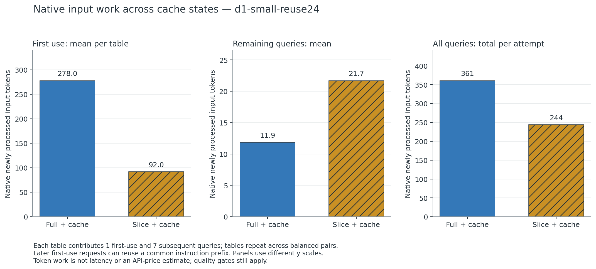
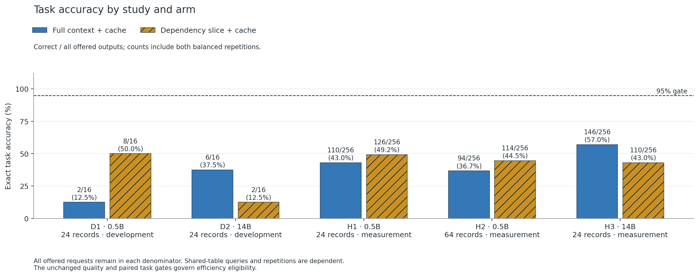
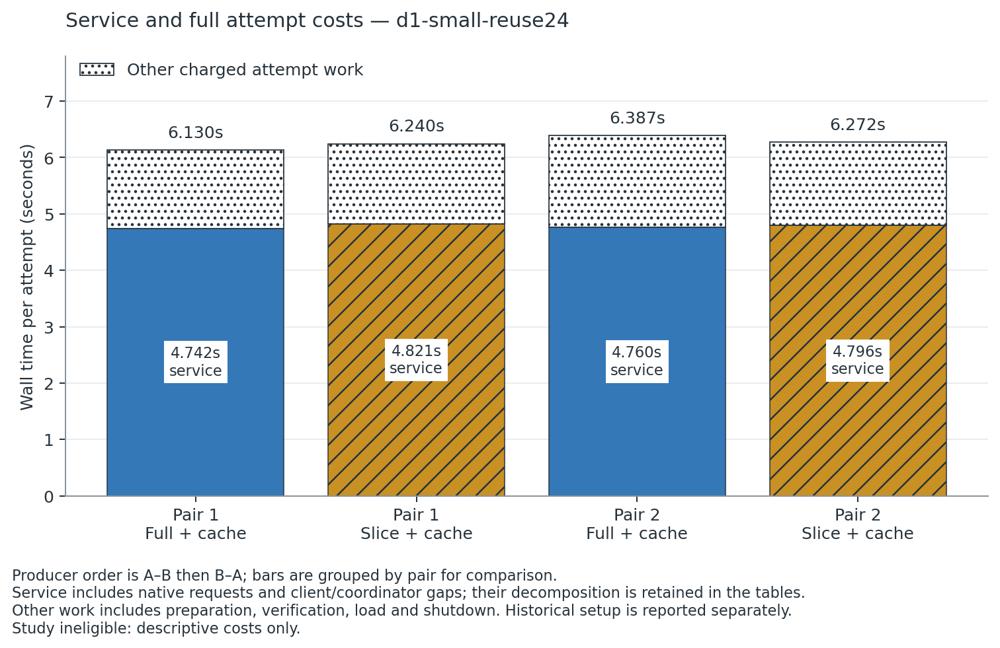

# Cold savings and warm-prefix costs on one repeated table

Historical D1-only memo, retained at its original evidence cutoff. The completed five-case investigation and final status are in the [manuscript](manuscript.md).

**This is a development result, not a confirmed efficiency finding.** On one 24-record table with eight changing queries, the cached full-context 0.5B baseline answered 1/8 correctly in both repetitions. The cached dependency-slice candidate answered 4/8 in both repetitions. Both failed the unchanged 95% requirement, so the preregistered small-model confirmation branch stopped. The native cache counters nevertheless expose a useful distinction between first-use and warm-query work.

## Question and design

The systems question is whether omission remains useful against a strong baseline that already caches the original table prefix. The known conflict between query-dependent compression and prefix reuse is studied directly in [Cache-Aware Prompt Compression](https://arxiv.org/abs/2607.15516). Its author-reported API cost model is prior art, not a prediction of CPU latency here. This experiment uses an exact classical record slicer rather than the learned compressors described in [RECOMP](https://arxiv.org/abs/2310.04408) or [LLMLingua-2](https://arxiv.org/abs/2403.12968).

The frozen case was `d1-small-reuse24`: Qwen2.5 0.5B FP16 profile v2, two compute threads, concurrency one, `record-reuse`, 24 records, development seed `940101`, and two balanced AB/BA pairs. Each attempt contained the same eight distinct queries about one generated table. Both arms enabled the identical same-slot cache mechanism and began with separate cold cache histories. The producer retained every first-use query, request and attempt. The current generator changes tables every eight queries; this tiny feasibility case therefore contains only one unique table.

## Retained observations

| Measure per eight-query attempt | Full context + cache | Dependency slice + cache |
|---|---:|---:|
| Exact answers, each repetition | 1/8 | 4/8 |
| New input tokens, first query | 278 | 92 |
| New input tokens, remaining seven queries | 83 | 152 |
| New input tokens, all eight queries | 361 | 244 |
| Reused input tokens, all eight queries | 1,863 | 491 |
| Full attempt wall, pair 1 | 6.130 s | 6.240 s |
| Full attempt wall, pair 2 | 6.387 s | 6.272 s |
| Service wall, pair 1 | 4.742 s | 4.821 s |
| Service wall, pair 2 | 4.760 s | 4.796 s |

Token accounting was identical across the two repetitions. On the seven warm queries, full context processed 11–13 new input tokens per request, whereas the changing slice processed 20–24. The slice saved 186 new tokens on the first query but incurred 69 additional new tokens over the warm queries. Keeping the cold primer in the denominator therefore matters: all-query totals favor the shorter input even though warm-query marginal work favors the full cached prefix. These are native work counters, not evidence of lower latency, energy use or API cost.

Each pair contained one task correct in both arms, zero correct only in the full-context arm, three correct only in the sliced arm, and four wrong in both arms. Six of eight output-token sequences differed. For example, request `r000` expected `DHQGX`: the full-context output was `DQGX`, while the sliced output was `DHQGX`. Slicing improved observed copying on several tasks but did not make this population quality-qualified.

Full attempt wall did not show a consistent direction across the two pairs. It included model/backend verification, model loading, prompt preparation and shutdown; service-only timings excluded those costs. No speedup ratio is reported because the quality gate failed and the population was explicitly development-sized.

All eight requests arrived simultaneously and were served through one slot, so client completion tails include waiting behind earlier requests. Nearest-rank p95 equals the observed maximum in an eight-request attempt: full-context end-to-end p95 was 4.738 and 4.753 seconds, versus 4.814 and 4.790 seconds for slicing. Client queue-before-dispatch p95 was 4.555–4.567 seconds for full context and 4.547–4.574 seconds for slicing. These dependent, tiny-population tails describe the actual batch; they do not predict paced or burst traffic.

## Integrity, costs and limits

All four attempts completed and all 32 offered requests were retained. Packaged `inspect`, `report` and `workbench` completed; the raw auditor reconciled all 32 native responses. Local export verification preserved the report and scientific payloads while redacting permitted operational model paths. The export remains unpublished.

The four native attempt envelopes total **25.028 seconds**. The queue's product-execution envelope is **29.500 seconds**, including admission, preceded by **450.004 seconds** waiting for the shared heavy-job queue. The original shared allocation span through this study's final retained producer observation is **20,081.098 seconds**; it includes historical setup, other retained studies and coordinator/idle time. It is not the cost of these 32 requests alone. The analysis deduplicates inherited intervals rather than adding overlapping per-study allocation spans. Sampled server/coordinator RSS is retained in the attempt table; no energy sensor was used.

One table and two dependent repetitions cannot establish a population cache crossover, significance, broad language quality or a general systems advantage. A symbolic interpreter solves this authored grammar without an LLM. The compact instruction language may itself limit model performance, but this study did not alter it after observing results. Any instruction-clarity change requires a new version and prospectively frozen development case; the original outputs remain adverse evidence. Additional-scale feasibility and confirmation remain pending.

## Reproducible evidence

- Producer case: `.cache/v1-investigations-20260908/systems/d1-small-reuse24/`
- Native study: that directory's `study/`; verified derivative: `export/`.
- Exact producer archive: `.cache/packaged-v1-platform-20260908-03/lean-model-lab.pyz`, SHA-256 `f90c48dd0be36b29c3188c365ba6b8ab2cbe709897cd7f4cce0e4825a147db6f`.
- Analysis: [analyze.py](analyze.py), [summary JSON](tables/summary.json), [all requests](tables/requests.csv), [paired correctness classes](tables/pairs.csv), and [attempt costs](tables/attempts.csv).
- Standalone figure code: [plot.py](plot.py); figures are also supplied as SVG and PDF.

The original generated tasks and project code are governed by the project's AGPL-3.0-only terms. The pinned official Qwen checkpoints declare Apache-2.0, and llama.cpp is MIT with a separately retained local patch. Model weights and backend binaries are not included in the study export. Exact source commits, file hashes, model/template identities and rights records remain in the producer configuration and preparation receipts. A separate skeptical reproduction has not yet been performed.
