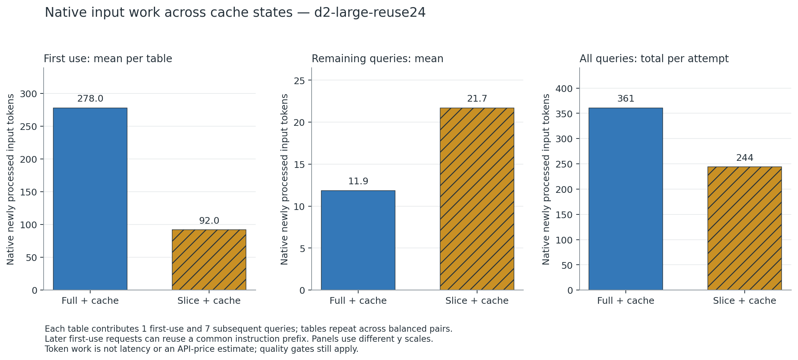
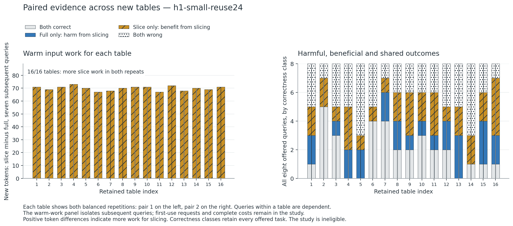
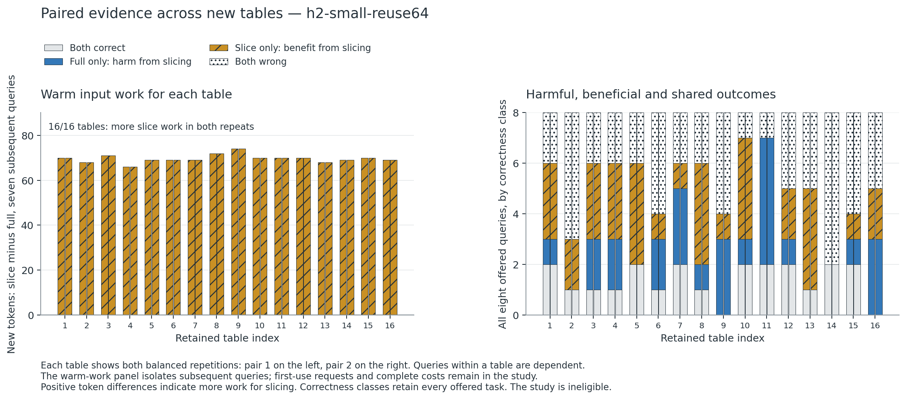
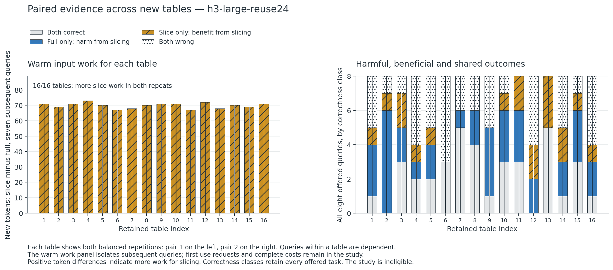
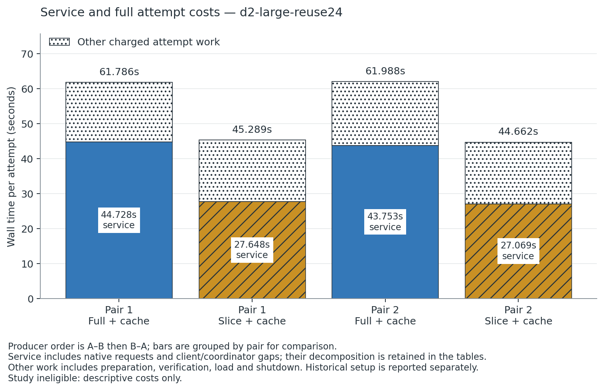
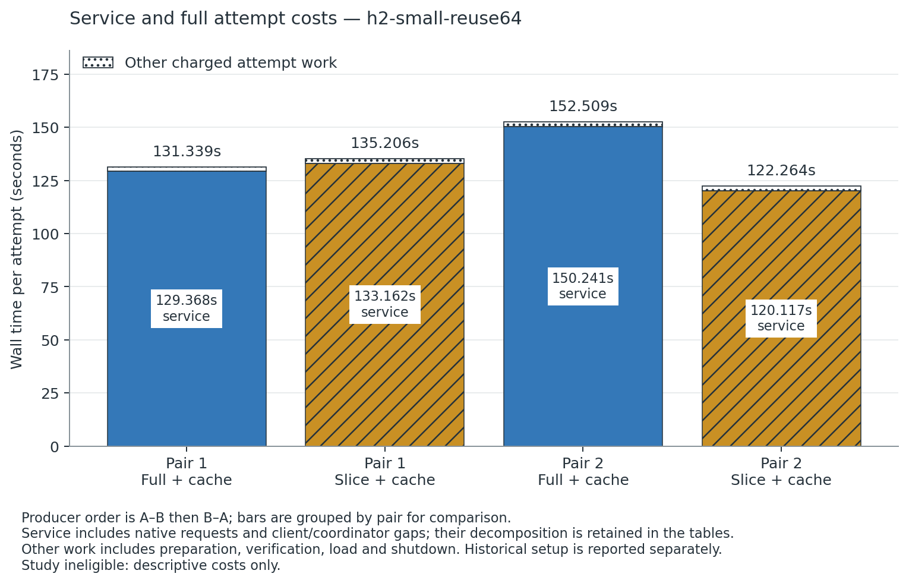
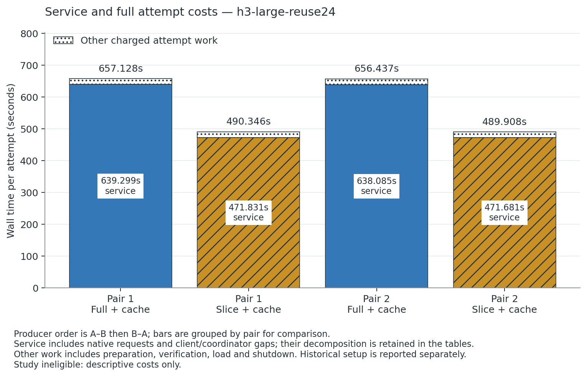

# Context omission under prefix reuse: an instrumented CPU transfer study

## Abstract

A shorter prompt can reduce first-use work while increasing work on subsequent queries, and aggregate accuracy can hide harmful omissions. We compare a deterministic record dependency slicer against a full-context baseline that already reuses its table prefix. Two frozen held-out 0.5B cases cover 32 distinct new tables across 24- and 64-record populations; a 14B case repeats the matched 24-record population. Slicing processes more new tokens after first use on every retained table, while first-use savings still favor slicing over each complete eight-query trajectory. No arm passes the unchanged 95% exact-answer gate. Each 128-query pair contains 24 and 25 harmful omissions in the 0.5B cases despite modest aggregate accuracy increases. On matched 14B, full-context accuracy is 73/128 versus 55/128 for slicing, with 36 harmful changes; lower sliced wall times accompany shorter, worse answers. At 64 records, product wall-time directions differ between pairs, and retained client/native timings expose substantial orchestration gaps. All five cases, 20 attempts and 1,600 offered native requests are retained. The result is a bounded systems counterexample, with no quality-qualified efficiency or novelty claim.

## Question and prior work

The question is when context omission ceases to offer a useful systems advantage against a strong full-context prefix-cache baseline. Query-dependent context compression changes the input prefix; prefix caching benefits from preserving it. [Cache-Aware Prompt Compression](https://arxiv.org/abs/2607.15516) directly studies that conflict through a two-tier API cost model. Its reported cache/pricing behavior motivates the question, but API cost is not a latency or energy model for this CPU experiment.

[RECOMP](https://arxiv.org/abs/2310.04408) and [LLMLingua-2](https://arxiv.org/abs/2403.12968) are relevant existing compression methods. We do not reproduce their trained compressors or benchmarks. Our candidate is an authored deterministic dependency slicer for a restricted record grammar; an independent symbolic interpreter can solve that grammar without an LLM. A dependency certificate establishes grammar facts, not unchanged logits, correct model answers or a population-risk guarantee. The intended contribution is an instrumented boundary or counterexample, with substantial prior-art overlap and no novelty claim.

## Design and execution

The predevelopment [protocol](protocol.md) specified an eight-request 0.5B feasibility case and a single 14B fallback if full-context quality failed. D1 used original `record-reuse`, 24 records, development seed `940101`, concurrency one, two threads and two balanced AB/BA pairs. D2 used the same generated request records, six threads and the predeclared 14B profile. A retained identity comparison verifies every request record and the complete workload digest across producers.

After both development configurations failed quality, a separate negative/system-cost challenge froze all three cells before its first native request: H1, 0.5B at 24 records with confirmation seed `940129`; H2, 0.5B at 64 records with seed `940193`; and H3, 14B at 24 records with seed `940129`. Each uses 128 queries over 16 tables, concurrency one and two balanced pairs, with two/two/six threads. All three are complete. H1 and H2 use different frozen table populations, so their comparison is a context-stratum comparison rather than an isolated causal estimate of record count. H1 and H3 use identical generated request records. Together they cover 32 distinct held-out tables, not 48 independent tables. These cells preserve adverse regimes and test fixed failure conditions; they do not reopen model, wording or seed search.

The generator also changes the lexical population between splits. Development keys and values begin with `D`; confirmation keys and values begin with `C`, followed in either split by four generated uppercase letters. Its pseudorandom stream is derived from a hash containing generator version, seed, family and split. Inspection of the exact archive 03/04 generator modules and every retained workload verifies these namespace rules for D1/D2 and H1/H2/H3, respectively; the [generator namespace check](generator-namespace-check.json) records the producer and workload hashes. Fresh held-out groups therefore do not establish IID sampling, exchangeability between development and confirmation, or lexical invariance. Development-to-confirmation differences include this namespace and population change. The matched H1/H3 comparison remains within the same confirmation population.

The retained host identifies an AMD Ryzen 9 7950X 16-Core Processor on Linux x86-64. Both configurations use CPU-only FP16 inference, a 2,048-token slot context, temperature zero, EOS enabled and a 32-token output limit; the case seed is retained for both workload generation and sampling. Native generated-token counts include EOS according to the backend's accounting. The shared allocation permits at most 12 compute threads, one heavy job, 60 decimal GB RAM and 200 decimal GB project disk under one original 12-hour deadline.

The primary comparison is `slice-versus-full-cache-v1`: both arms enable identical same-slot caching. Baseline receives the complete original table; candidate receives its query-dependent dependency slice. Each arm starts its own actual cold cache. Eight distinct queries share one table, with every first-use request retained. All requests arrive simultaneously, so client end-to-end timings include the queue behind earlier requests. This is not paced-traffic evidence.

Cold here refers to native prompt-prefix/KV history. Operating-system file/page caches are not purged, and model loading is not assumed to begin from cold storage. The full attempt envelope still charges the actual verification and loading work.

The unchanged platform gate requires both arms to achieve at least 95% task accuracy and no observed pair-level aggregate quality loss. Eight-request feasibility therefore requires 8/8 in each relevant attempt. A failed feasibility population is not expanded into an efficiency confirmation sweep. D2 explicitly required both arms to clear the gate, with no further model, seed or wording search after failure. Development-sized cases cannot become eligible measurement claims even if their timings improve.

D1 used immutable product archive 03; D2 used archive 04, which preserved the original grammar. Their exact archive, implementation, backend, model, shard and template identities are recorded in the [rerun guide](reproduce.md) and [analysis provenance](tables/summary.json). D1 and D2 differ in model profile, compute-thread count, separately built server digest and product archive. They are a bounded transfer between admitted configurations, not an isolated causal estimate of parameter count. Each native execution used the product CLI through the shared queue helper. No scratch-model runner supplied evidence.

## Observed quality and harmful changes

| Configuration | Full context, each repeat | Slice, each repeat | Both correct | Full only correct | Slice only correct | Both wrong |
|---|---:|---:|---:|---:|---:|---:|
| D1: 0.5B, 24 records | 1/8 | 4/8 | 1 | 0 | 3 | 4 |
| D2: 14B, same requests | 3/8 | 1/8 | 0 | 3 | 1 | 4 |
| H1: 0.5B, 24 records, 16 held-out tables | 55/128 | 63/128 | 31 | 24 | 32 | 41 |
| H2: 0.5B, 64 records, 16 held-out tables | 47/128 | 57/128 | 22 | 25 | 35 | 46 |
| H3: 14B, same held-out requests as H1 | 73/128 | 55/128 | 37 | 36 | 18 | 37 |

The four correctness classes are per pair—eight tasks in each development case and 128 in each held-out case—and repeated exactly across each case's two pairs. Six output-token sequences changed per pair in D1; all eight changed in D2. Thus an aggregate change does not preserve individual task correctness. On 14B, `r000` expected `DHQGX`: full context returned `DHQGX`, while slicing returned `H`. Conversely, `r002` expected `DUETA`: full context returned `UETA`, while slicing returned the correct full value. The complete [request table](tables/requests.csv) retains every output, not selected examples alone.

The full-context baseline fails at both admitted model scales, and the direction of the observed slicing-quality change reverses between them on both the development and matched held-out populations. This defeats an inference that grammar-preserving omission necessarily preserves model behavior. Each development case contains the same single table. H1 adds 16 new tables with no development-table overlap: harmful omissions occur in 13/16 table groups, and even the observed either-answer-correct ceiling reaches only 87/128. This ceiling consumes both outputs and the known answer; it is not a deployable selector or free oracle. H2 adds 16 separately seeded tables with 25 harmful changes in 12/16 groups, 35 beneficial changes and 46 tasks wrong in both arms per pair; its observed either-answer-correct ceiling is 82/128. H3 repeats H1's population at the admitted 14B configuration: 36 harmful changes occur across 14/16 groups, with 18 beneficial changes and an observed either-answer-correct ceiling of 91/128. Its two pairs reproduce all four correctness classes exactly. These retrospective ceilings are below 95%, and the results do not establish natural-language quality.

## First-use savings and warm-prefix costs

On the matched development population, native token accounting was identical between repetitions and between the two admitted model configurations:

| Input work per eight-query attempt | Full context + cache | Dependency slice + cache |
|---|---:|---:|
| First query: new tokens | 278 | 92 |
| Remaining seven queries: new tokens | 83 | 152 |
| All queries: new tokens | 361 | 244 |
| All queries: reused tokens | 1,863 | 491 |

Slicing saves 186 new input tokens on first use and incurs 69 additional new input tokens over the seven warm queries. The full cached prefix needs only 11–13 new input tokens per warm query; the changing slice needs 20–24. The aggregate still favors slicing on this eight-query trajectory because first-use savings dominate. Removing the primer would reverse the apparent direction. Both denominators describe actual retained histories, but only the all-query denominator accounts for the full offered trajectory.

In H1, both repetitions again had identical token accounting. Full context processed 3,368 new tokens on the 16 first-use requests and 1,338 on the remaining 112 queries; slicing processed 414 and 2,456, respectively. The all-query totals were 4,706 versus 2,870. A later table's first use reused a common native instruction prefix rather than being forced to an empty cache. Warm slicing required an additional 67–73 new tokens per table in **all 16 table groups**, while first-use savings dominated the complete trajectory.

H2 preserves the same direction on all 16 longer-context tables: full context processed 8,462 first-use and 1,328 subsequent-query new tokens, versus 417 and 2,442 for slicing. Complete-trajectory totals were 9,790 versus 2,859. These are distinct native histories; the first-use and subsequent-query decomposition does not delete either component from the full cost.

H3 reproduces H1's native input counters exactly in both repetitions: full context uses 4,706 newly processed and 30,668 reused tokens per attempt, versus 2,870 newly processed and 8,899 reused tokens for slicing. The subsequent-query difference remains positive for all 16 matched tables. Thus the input-work pattern transfers between these admitted model configurations, while their observed quality changes have opposite directions.

These counters identify a systems interaction. They do not establish a latency crossover, predict a number of queries after which one approach wins, or convert directly to API prices or energy. We did not extend the eight-query trajectory counterfactually, pool the arms' cache states, or assume unobserved reuse.

## Timing, outputs and complete cost

| Case and pair | Full service | Slice service | Full attempt wall | Slice attempt wall |
|---|---:|---:|---:|---:|
| D1 pair 1 | 4.742 s | 4.821 s | 6.130 s | 6.240 s |
| D1 pair 2 | 4.760 s | 4.796 s | 6.387 s | 6.272 s |
| D2 pair 1 | 44.728 s | 27.648 s | 61.786 s | 45.289 s |
| D2 pair 2 | 43.753 s | 27.069 s | 61.988 s | 44.662 s |
| H1 pair 1 | 81.187 s | 76.233 s | 83.090 s | 78.248 s |
| H1 pair 2 | 82.203 s | 73.950 s | 84.335 s | 76.012 s |
| H2 pair 1 | 129.368 s | 133.162 s | 131.339 s | 135.206 s |
| H2 pair 2 | 150.241 s | 120.117 s | 152.509 s | 122.264 s |
| H3 pair 1 | 639.299 s | 471.831 s | 657.128 s | 490.346 s |
| H3 pair 2 | 638.085 s | 471.681 s | 656.437 s | 489.908 s |

D1 shows no consistent full-wall reduction. D2's lower sliced wall time accompanies worse correctness and fewer generated output tokens: 17 per sliced attempt versus 29 per full-context attempt. It is therefore not a quality-qualified efficiency gain. Full wall includes preparation, tokenization, model/backend verification, loading, service and shutdown. H1 output lengths were nearly equal—534 native generated tokens for full context and 532 for slicing per attempt—so its timing comparison has a much smaller output-count difference than D2. It still fails absolute quality. No speedup ratio is reported.

H2's native generated-token totals were 551 for full context and 535 for slicing per attempt. Its first pair nevertheless had higher sliced product wall time, while its second pair had lower sliced wall time. A post hoc diagnostic decomposition of the already retained timestamps shows why native work and product elapsed time must remain separate; it changes no population, gate, outcome or native execution:

| H2 pair 1, 128 queries | Full context + cache | Slice + cache |
|---|---:|---:|
| Native reported prompt duration, summed | 63.696 s | 20.136 s |
| Native reported generation duration, summed | 11.204 s | 10.173 s |
| Client dispatch-to-completion interval union | 75.951 s | 43.789 s |
| Service time outside those client intervals | 53.418 s | 89.373 s |
| Complete service envelope | 129.368 s | 133.162 s |

All cases use one slot, so the client interval union contains no concurrent request overlap. The sliced first pair includes 87.985 seconds specifically between one request's completion and the next dispatch. Request `r055` additionally took 12.734 seconds from client dispatch to completion despite 0.289 seconds of native reported prompt-plus-generation duration. This 12.445-second discrepancy remains in the observed tail; it is not filtered out.

The immutable archive 04 runner durably checkpoints completed requests, samples resources and periodically scans the project directory between dispatches. Those operations and the shared host belong to the instrumented product's cost, but their individual durations were not recorded. We therefore identify measured client/coordinator gaps without attributing them to a specific operation or converting them into CPU/energy measurements. The native counters support the cache-work pattern; these product timings do not isolate bare inference latency. No runtime change or rerun was made in response to this observation.

H3 has lower sliced wall time in both pairs, but slicing produces 386 native output tokens per attempt versus 492 for full context and loses 18 correct answers per pair. The full-context client dispatch-to-completion interval union is 606.875–607.662 seconds, with a further 31.210–31.637 seconds inside the service envelope; the sliced union is 404.719–406.901 seconds, with 64.780–67.112 seconds outside those intervals. These retained costs and output differences prevent attributing the observed wall-time change solely to input compression, even before the failed quality gate.

The nearest-rank end-to-end p95 is the observed maximum for eight requests. D1 full-context p95 was 4.738–4.753 seconds versus 4.790–4.814 seconds for slicing. D2 full-context p95 was 43.739–44.708 seconds versus 27.056–27.185 seconds for slicing. These dependent, simultaneous-arrival batches do not support traffic-general tail claims. Per-request queue-before-dispatch, TTFT, native prompt/generation milliseconds and completion times remain in the CSV tables.

Across all five cases, 20 native attempt envelopes total **3,395.574 seconds**. Product-execution envelopes total **3,432.123 seconds**, including admission, and queue waiting totals **3,420.068 seconds**. The original shared-allocation span through the final retained producer observation is **27,964.801 seconds**. Its deduplicated attributed interval union is **23,094.212 seconds**, including **19,698.638 seconds** of inherited setup, prior work and finalization outside the current attempts. The remaining **4,870.588 seconds** is an unattributed interval that may include coordination, idle time or other work absent from retained setup records; it is not measured idle time. These historical costs are not attributed as the marginal cost of 1,600 requests, and overlapping per-study spans are never added. The fixed campaign used all 1,600 admitted requests and 57.202 minutes of its conservative 90-minute product-execution ceiling; the [final budget record](provenance/final-campaign-status.json) retains per-case execution and queue costs. No further native runs are admitted by this study.

Sampled aggregate coordinator/server RSS was approximately 1.445–1.458 decimal GB in D1 and 30.132–30.171 decimal GB in D2. The attempt table retains the held-out memory observations, server VmHWM and host load averages before/after each attempt. These are scoped process/load observations, not a continuous whole-host peak. This runner does not retain per-phase CPU-time counters, and no admitted energy or thermal sensor was used; load averages do not supply those missing measurements.

The allocation-span figures end at the final retained producer observation. Subsequent analysis, export review and packaging occur under the continuing original mission clock but are outside that particular producer-observation cutoff. The coordinator's final mission accounting is needed for the later complete mission span.

## Integrity and limits

All 20 native attempts completed and all 1,600 offered requests were observed across the five cases. Each case passed packaged `inspect`, `report` and `workbench` operations, raw-response reconciliation and local export verification. The reports themselves remain scientifically ineligible. Successful verification establishes evidence integrity; it does not erase the quality failures. Exports are verified local derivatives; these checks alone do not establish publication or external validation.

Two deterministic repetitions do not provide independent samples. Across development and held-out cases, the exact population check finds 33 distinct tables and 264 distinct query prompts; repeated arms, balanced pairs and matched-model populations account for the 1,600 native records. The study supplies no independent-request confidence interval, broad model-quality claim or general cache crossover. Development outcomes motivated the declared negative challenge, whose complete population was frozen before execution and whose adverse outcomes are retained. The completed coverage is limited to this grammar, these two admitted model configurations, 24/64-record context strata, eight queries per table and simultaneous arrivals at concurrency one. Altered arrivals, 14B at 64 records, other models and an external skeptical native reproduction are untested. The development fixtures are not relabeled as independent confirmed findings.

All six analysis outputs were recomputed from the actual exported studies and matched fresh original-study reanalysis byte for byte. A second check copied the exported studies and portable provenance, renamed the staged package, then ran isolated Python from an unrelated working directory with a new external output path; all six outputs again matched exactly. The [export proof](export-reanalysis-check.json), [relocation proof](portable-relocation-check.json) and [portable rerun guide](PUBLICATION-RERUN.md) retain that evidence. This is an author-performed reproducibility check, not an independent replication.

Generated tasks and project code use the project's AGPL-3.0-only terms. Both pinned official Qwen checkpoints declare Apache-2.0; the pinned llama.cpp backend is MIT with a separately retained patch. Models and backend binaries are separate dependencies and are not included in the exports. There is no claim of human-subject evaluation, external institutional validation or measured energy savings.

The [analysis code](analyze.py), [CSV tables](tables/cases.csv), [pair classes](tables/pairs.csv), [attempt costs](tables/attempts.csv), [summary/provenance JSON](tables/summary.json), [standalone plotting code](plot.py), [protocol](protocol.md) and [rerun instructions](reproduce.md) supply the reproducibility package. PNG, SVG and PDF figures are generated directly from retained data.
